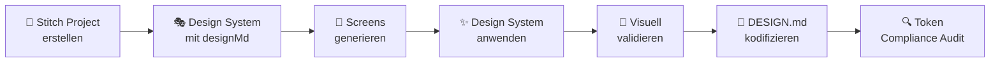

# /stitch-design-system — Von Stitch Prototyping zur kodifizierten DESIGN.md

> **Zweck:** Dieser Workflow dokumentiert den bewährten Prozess, wie wir über Google Stitch MCP ein visuell validiertes Design System erstellen und in eine kanonische `DESIGN.md` überführen.
> **Erstellt aus:** Autarch Dashboard v2 Referenz-Workflow (`projects/16993962936118562564`)

---

## Voraussetzungen

- StitchMCP Server ist aktiv und verbunden
- Steve Jobs Persona ist für Vision/UX aktiviert  
- Rauno Freiberg Persona ist für Code-Exekution bereit
- Das Projekt hat eine klare Produkt-Vision (Paradigma, User-Rolle, North Star)

---

## Phase 1: Stitch Projekt erstellen

```
Schritt 1.1: Neues Stitch-Projekt erstellen
→ Tool: mcp_StitchMCP_create_project
→ Titel: "[PRODUKT] Dashboard [Version]"
→ Ergebnis: Project ID notieren (z.B. "16993962936118562564")
```

---

## Phase 2: Design System in Stitch definieren

```
Schritt 2.1: Design System erstellen mit `designMd`
→ Tool: mcp_StitchMCP_create_design_system
→ Das `designMd` Feld ist der ENTSCHEIDENDE Input — hier schreibst du die vollständige
  Design-Philosophie als Markdown, NICHT nur Token-Werte.

Struktur des designMd:
  1. Overview & Creative North Star (1-2 Absätze Vision)
  2. Colors & Surface Philosophy (No-Line Rule, Surface Hierarchy, Glass & Gradient)
  3. Typography (Font-Pairing, Hierarchie)
  4. Elevation & Depth (Tonal Layering, Ghost Borders, Glow Effects)
  5. Components (Buttons, Cards, Lists, Input Fields, Status Chips)
  6. Do's and Don'ts (Verbotene Patterns, Pflicht-Patterns)

Parameter-Referenz:
  designSystem:
    displayName: "[NAME] — z.B. 'Autarch Kinetic'"
    theme:
      colorMode: "DARK" | "LIGHT"
      font: "INTER" | "PLUS_JAKARTA_SANS" | "ROBOTO" | etc.
      roundness: "ROUND_FOUR" | "ROUND_EIGHT" | "ROUND_TWELVE"
      customColor: "#0ea5e9"  // Primary accent hex
      headlineFont: "[FONT]"
      bodyFont: "[FONT]"
      labelFont: "[FONT]"
      colorVariant: "FIDELITY"  // Stitch Color-Generation Mode
      overridePrimaryColor: "#[HEX]"
      overrideSecondaryColor: "#[HEX]"
      overrideTertiaryColor: "#[HEX]"
      overrideNeutralColor: "#[HEX]"   // Background base
      spacingScale: 2  // 1=tight, 2=standard, 3=generous
      designMd: "[VOLLSTÄNDIGES DESIGN-SPEC MARKDOWN]"
```

> [!IMPORTANT]
> **Das `designMd` ist das Herzstück.** Stitch generiert daraus Material Design 3 kompatible `namedColors` und wendet die Philosophie auf alle generierten Screens an. Je detaillierter die Design-Spec, desto besser die Ergebnisse.

```
Schritt 2.2: Design System updaten und dem Projekt zuweisen
→ Tool: mcp_StitchMCP_update_design_system
→ name: "assets/[ASSET_ID]" (aus create_design_system Ergebnis)
→ projectId: "[PROJECT_ID]"
```

---

## Phase 3: Screens generieren (Iterativ)

```
Schritt 3.1: Kern-Screens generieren
→ Tool: mcp_StitchMCP_generate_screen_from_text
→ Beginne mit den wichtigsten Screens:
  1. Command Center / Dashboard (Landing Page)
  2. Primäre Entity-Liste (z.B. Agents, Patients, Products)
  3. Detail-Ansicht (Three-Pane Layout)
  4. Settings / Konfiguration
  5. Onboarding (Step 1)

Prompt-Template für Screen-Generierung:
  "[PRODUKT] [SCREEN_NAME] — A dark mode dashboard showing [BESCHREIBUNG].
   Left sidebar with navigation categories (OPERATE, MONITOR, CONFIGURE).
   Main area with [LAYOUT]. Use glassmorphism cards, cyan accents (#0ea5e9),
   no structural borders, tonal depth through background shifts.
   Desktop 1280px viewport."

Schritt 3.2: Varianten generieren (optional für Exploration)
→ Tool: mcp_StitchMCP_generate_variants
→ variantOptions: { numVariants: 2-3, creativeRange: "medium" }
→ Hilft beim Entdecken alternativer Layouts

Schritt 3.3: Screens editieren (Feinschliff)
→ Tool: mcp_StitchMCP_edit_screens
→ Konkrete Anweisungen: "Move the KPI cards to a horizontal row",
  "Add a glass sidebar", "Change the header to include breadcrumbs"
```

---

## Phase 4: Design System auf Screens anwenden

```
Schritt 4.1: Design System auf alle Screens anwenden
→ Tool: mcp_StitchMCP_apply_design_system
→ assetId: "[DESIGN_SYSTEM_ASSET_ID]"
→ projectId: "[PROJECT_ID]"
→ selectedScreenInstances: [alle Screen Instance IDs aus get_project]

Schritt 4.2: Visuelle Validierung
→ Screenshots der generierten Screens prüfen
→ Stimmt die Farb-Hierarchie?
→ Werden die No-Line Rules eingehalten?
→ Ist die Glassmorphism-Anwendung konsistent?
```

---

## Phase 5: Design System Varianten erstellen

> [!TIP]
> Erstelle mindestens 2 Design-System-Varianten zum Vergleich. Bei Autarch waren es 5 Varianten (Kinetic, Neo, Obsidian, Luminous Architect).

```
Empfohlene Varianten:
  1. "[PRODUKT] Kinetic"     — Dark, Inter, ROUND_EIGHT (Standard)
  2. "[PRODUKT] Obsidian"    — Dark, Jakarta Sans, ROUND_FOUR (Editorial)
  3. "[PRODUKT] Luminous"    — Light, Jakarta Sans, ROUND_FOUR (Helle Variante)

Warum Varianten?
  - Visuelle A/B-Tests vor der Kodifizierung
  - Light + Dark Mode Token-Extraction
  - Verschiedene Typography-Pairings evaluieren
  - Stitch generiert für jede Variante vollständige namedColors → Token-Grundlage
```

---

## Phase 6: Kodifizierung → DESIGN.md

```
Schritt 6.1: Template kopieren
→ Kopiere `antigravity-kit/templates/design-system/DESIGN.md` in dein Projekt
→ Ziel: `[PROJECT_DIR]/dashboard/DESIGN.md` oder `[PROJECT_DIR]/DESIGN.md`

Schritt 6.2: Token-Extraktion aus Stitch
→ Lies die Design Systems via mcp_StitchMCP_list_design_systems
→ Extrahiere die `namedColors` → Überführe in CSS Custom Properties
→ Mapping: surface → --bg-primary, surface_container_low → --bg-secondary, etc.

Schritt 6.3: Befülle DESIGN.md
→ Stitch Reference Sektion mit Project ID, Variante, Fonts
→ Token Tables mit den extrahierten Hex-Werten
→ Creative North Star aus dem designMd
→ Verbotene Farben definieren (z.B. NO PURPLE)

Schritt 6.4: Knowledge File erstellen
→ Kopiere `antigravity-kit/.antigravity/knowledge/ux-design-system.md`
→ Befülle die projekt-spezifischen Werte
→ Dieses File wird von Build-Personas (Steve Jobs, Rauno) automatisch geladen

Schritt 6.5: Compliance Audit
→ Nach der ersten UI-Implementation:
   grep -rn '#[0-9a-fA-F]\{6\}' --include='*.tsx' --include='*.css' src/
→ Alle gefundenen hardcoded Hex-Werte → entweder auf Token migrieren oder
   als "Intentional Exception" in Section 9 dokumentieren
```

---

## Zusammenfassung: Der Stitch-zu-DESIGN.md Pipeline



---

## Referenz: Autarch Stitch-Projekt

| Aspekt | Wert |
|---|---|
| Projekt ID | `16993962936118562564` |
| Screens | 10 (Command Center, Agents, Issues, Settings×2, Onboarding, Sidebar, Light×3) |
| Design Systems | 5 Varianten (Kinetic, Neo, Obsidian, Luminous) |
| Gewählte Variante | Autarch Kinetic (Inter, ROUND_EIGHT, `#0ea5e9`) |
| Nord-Stern | "The Sentinel Overlay" |
| Verbotene Farbe | Purple/Violet |
| Skill-Source | `google-labs-code/stitch-skills/design-md` |
