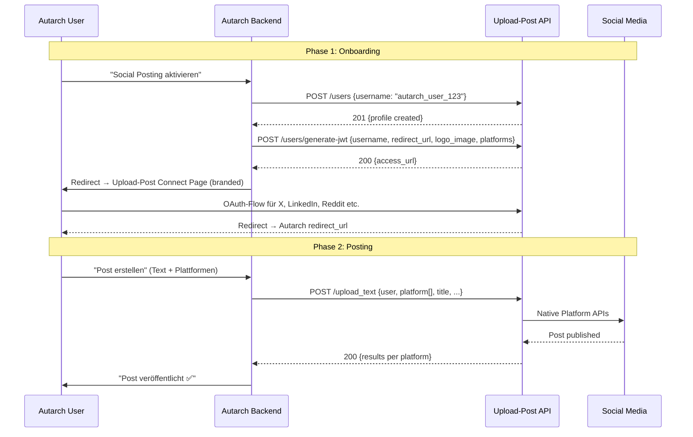

# Upload-Post API — Integration Documentation

> **Quelle:** [upload-post.com](https://upload-post.com)  
> **Provider:** TONVI TECH SL, Spanien (EU) 🇪🇺  
> **Stand:** 30.03.2026  
> **Status:** ✅ Final Architecture Decision  
> **Zweck:** Unified Social Media Publishing API für die Autarch Autonomous Operations Engine (Project Olympus, Phase 5)

---

## Übersicht

Upload-Post ist eine Unified API für Social Media Content Publishing. Eine einzige Integration für alle großen Plattformen. Für Autarch ist dies der primäre Publishing-Layer für die Social Media Chain.

**Ein API-Key → 11 Plattformen. Kein eigener OAuth-Flow. EU-basiert, DSGVO-konform, Whitelabel-fähig.**

### Wettbewerbsvergleich (Warum Upload-Post?)

| Kriterium | Upload-Post | Ayrshare | OneUp | Buffer |
|-----------|-------------|----------|-------|--------|
| **Preis** | $16/mo (Basic) | $149/mo (Premium) | $60/mo | $120/mo |
| **Reddit** | ✅ | ✅ | ❌ | ❌ |
| **Whitelabel** | ✅ (JWT + Branding) | ✅ (teurer) | ❌ | ❌ |
| **DSGVO** | ✅ EU (Spanien) | ⚠️ USA | ⚠️ USA | ⚠️ USA |
| **n8n/Make** | ✅ Native | ✅ | ❌ | ❌ |
| **LLM Docs** | ✅ `llm.txt` | ❌ | ❌ | ❌ |
| **Queue System** | ✅ Built-in | ❌ | ✅ | ✅ |
| **AutoDM** | ✅ Instagram | ❌ | ❌ | ❌ |
| **Document Upload** | ✅ LinkedIn | ❌ | ❌ | ❌ |

### Unterstützte Plattformen

| Plattform | Video | Foto | Text | Analytics | DMs | Comments |
|-----------|-------|------|------|-----------|-----|----------|
| TikTok | ✅ | ✅ | ❌ | ✅ | ❌ | ❌ |
| Instagram | ✅ | ✅ | ❌ | ✅ | ✅ | ✅ |
| LinkedIn | ✅ | ✅ | ✅ | ✅ | ❌ | ❌ |
| YouTube | ✅ | ❌ | ❌ | ✅ | ❌ | ❌ |
| Facebook | ✅ | ✅ | ✅ | ✅ | ❌ | ❌ |
| X (Twitter) | ✅ | ✅ | ✅ | ✅ | ❌ | ❌ |
| Threads | ✅ | ✅ | ✅ | ✅ | ❌ | ❌ |
| Pinterest | ✅ | ✅ | ❌ | ✅ | ❌ | ❌ |
| Reddit | ✅ | ✅ | ✅ | ✅ | ❌ | ❌ |
| Bluesky | ✅ | ✅ | ✅ | ✅ | ❌ | ❌ |
| Google Business | ✅ | ✅ | ✅ | ❌ | ❌ | ❌ |

### Autarch-Integration Highlights

- **Multi-Tenant:** User Profiles API ermöglicht Company-Level OAuth-Isolation
- **Queue System:** Nativer Scheduling-Support mit Queue Slots
- **Async Uploads:** Background Processing mit Status Polling (Auto-Fallback bei >59s Verarbeitung)
- **Analytics:** Cross-Platform Analytics Aggregation
- **AutoDM:** Instagram Engagement Automation
- **FFmpeg:** Server-seitige Video-Verarbeitung
- **Whitelabel:** Custom-branded Connect Pages mit Logo, Redirect, Descriptions
- **Idempotency:** Native Idempotency-Keys verhindern Duplicate Posts bei Retries

---

## Authentication

Alle API Requests erfordern einen API Key im Authorization Header:

```
Authorization: Apikey YOUR_API_KEY
```

**Base URL:** `https://api.upload-post.com/api`

### Pricing & Rate Limits

| Plan | Preis | Uploads/Monat | Profile | FFmpeg (min/mo) |
|------|-------|---------------|---------|------------------|
| Free | $0 | 10 | 1 | 30 |
| Basic | $16 | Unlimited | 5 | 300 |
| Professional | $49 | Unlimited | 25 | 1.000 |
| Business | $99 | Unlimited | 225 | 10.000 |
| Enterprise | Custom | Unlimited | Unlimited | Custom |

---

## Core Upload APIs

### POST /api/upload_videos — Video Upload

Upload Videos zu allen unterstützten Plattformen.

**Common Parameters:**

| Name | Type | Required | Description |
|------|------|----------|-------------|
| user | String | Yes | User identifier (profile name) |
| platform[] | Array | Yes | Platform(s) to upload to |
| video | File | Yes | Video file or URL |
| title | String | Conditional | Default title. Required for YouTube/Reddit |
| description | String | No | Extended text for LinkedIn/Facebook/YouTube/Pinterest |
| scheduled_date | String (ISO-8601) | No | Schedule publishing (≤ 365 days future) |
| timezone | String (IANA) | No | Timezone for scheduled_date |
| request_id | String | No | Client-provided tracking ID |
| async_upload | Boolean | No | Background processing |
| add_to_queue | Boolean | No | Auto-schedule to next queue slot |
| first_comment | String | No | Auto-post first comment after publishing |

**Platform-Specific Parameters:**

#### TikTok
| Name | Type | Description | Default |
|------|------|-------------|---------|
| tiktok_title | String | TikTok-specific title (max 2200 chars) | title |
| privacy_level | String | PUBLIC_TO_EVERYONE, MUTUAL_FOLLOW_FRIENDS, FOLLOWER_OF_CREATOR, SELF_ONLY | PUBLIC_TO_EVERYONE |
| post_mode | String | DIRECT_POST or MEDIA_UPLOAD (draft) | DIRECT_POST |
| disable_duet | Boolean | Disable duet | false |
| disable_comment | Boolean | Disable comments | false |
| cover_timestamp | Integer | Cover frame timestamp (ms) | 1000 |
| is_aigc | Boolean | AI-generated content flag | false |

#### Instagram
| Name | Type | Description | Default |
|------|------|-------------|---------|
| instagram_title | String | Instagram-specific caption | title |
| media_type | String | REELS or STORIES | REELS |
| share_mode | String | CUSTOM, TRIAL_REELS_SHARE_TO_FOLLOWERS_IF_LIKED, TRIAL_REELS_DONT_SHARE_TO_FOLLOWERS | CUSTOM |
| collaborators | String | Comma-separated collaborator usernames | - |
| cover_url | String | Custom video cover URL | - |
| user_tags | String | Comma-separated user tags | - |
| location_id | String | Instagram location ID | - |

#### YouTube
| Name | Type | Description | Default |
|------|------|-------------|---------|
| youtube_title | String | YouTube-specific title | title |
| youtube_description | String | Video description | title |
| tags | Array | Video tags | [] |
| categoryId | String | Video category | "22" |
| privacyStatus | String | public, unlisted, private | "public" |
| thumbnail | File | Custom thumbnail (JPG/PNG/GIF/BMP, max 2MB) | - |
| selfDeclaredMadeForKids | Boolean | COPPA compliance | false |
| containsSyntheticMedia | Boolean | AI content declaration | false |

#### LinkedIn
| Name | Type | Description | Default |
|------|------|-------------|---------|
| linkedin_title | String | LinkedIn-specific title | title |
| linkedin_description | String | Post commentary | title |
| visibility | String | CONNECTIONS, PUBLIC, LOGGED_IN, CONTAINER | PUBLIC |
| target_linkedin_page_id | String | Organization page ID | - |

#### Facebook
| Name | Type | Description | Default |
|------|------|-------------|---------|
| facebook_title | String | Facebook-specific title | title |
| facebook_page_id | String | Page ID (required) | - |
| facebook_media_type | String | REELS, STORIES, VIDEO | REELS |

#### X (Twitter)
| Name | Type | Description | Default |
|------|------|-------------|---------|
| x_title | String | Tweet text | title |
| x_long_text_as_post | Boolean | Single post vs thread | false |
| reply_settings | String | Who can reply | - |
| community_id | String | Community posting | - |
| reply_to_id | String | Reply to tweet ID | - |

#### Pinterest
| Name | Type | Description | Default |
|------|------|-------------|---------|
| pinterest_title | String | Pin title | title |
| pinterest_board_id | String | Board ID (required) | - |
| pinterest_link | String | Destination link | - |

#### Reddit
| Name | Type | Description | Default |
|------|------|-------------|---------|
| reddit_title | String | Post title | title |
| subreddit | String | Target subreddit (without r/) | - |
| flair_id | String | Post flair | - |

#### Bluesky
| Name | Type | Description | Default |
|------|------|-------------|---------|
| bluesky_title | String | Post text | title |

*Bluesky Limits: 10GB/day, 25 videos/day, 100MB max. Formats: .mp4, .mpeg, .webm, .mov*

#### Google Business Profile
| Name | Type | Description | Default |
|------|------|-------------|---------|
| gbp_location_id | String | Location to post to | Auto |
| gbp_topic_type | String | STANDARD, EVENT, OFFER | STANDARD |
| gbp_cta_type | String | BOOK, ORDER, SHOP, LEARN_MORE, SIGN_UP, CALL | - |
| gbp_cta_url | String | CTA button URL | - |

**Responses:**
- `200 OK` — Synchronous success
- `200 OK` — Async/background started (includes `request_id`)
- `202 Accepted` — Scheduled (includes `job_id`)
- `400` — Bad Request
- `401` — Unauthorized
- `429` — Rate limit exceeded

---

### POST /api/upload_photos — Photo Upload

Upload Fotos und Mixed-Media Carousels.

**Additional Photo Parameters:**

| Name | Type | Description |
|------|------|-------------|
| photos[] | Array | Array of photo files. Instagram/Threads: Videos allowed for mixed carousels |

*Supports all same platform-specific parameters as video upload plus:*

#### Instagram Photo-Specific
| Name | Type | Description |
|------|------|-------------|
| media_type | String | IMAGE or STORIES |
| collaborators | String | Collaborator usernames |

#### X Photo-Specific
| Name | Type | Description |
|------|------|-------------|
| x_thread_image_layout | String | Image distribution across thread tweets (e.g., "4,4") |
| tagged_user_ids | Array | User IDs to tag (max 10) |

#### Threads Photo-Specific
| Name | Type | Description |
|------|------|-------------|
| threads_thread_media_layout | String | Media distribution across posts (e.g., "5,5"). Max 10 items/post |

---

### POST /api/upload_text — Text Upload

Text-only Posts.

**Supported Platforms:** X, LinkedIn, Facebook, Threads, Reddit, Bluesky, Google Business Profile

**Additional Parameters:**

| Name | Type | Description |
|------|------|-------------|
| link_url | String | URL for link preview card (LinkedIn, Bluesky, Facebook, Reddit) |

**Platform-Specific Link Parameters:**
- `linkedin_link_url` — LinkedIn link preview
- `bluesky_link_url` — Bluesky external embed
- `facebook_link_url` — Facebook link preview
- `reddit_link_url` — Reddit link post (creates `kind: link` instead of self-post)

**Twitter Poll Support:**
| Name | Type | Description |
|------|------|-------------|
| poll_options | Array | 2-4 options, max 25 chars each |
| poll_duration | Integer | Minutes (5-10080) |

**Auto-Threading:** Text > 280 chars (X), > 500 chars (Threads), > 300 chars (Bluesky) automatically creates threaded posts with intelligent paragraph grouping.

---

### POST /api/upload_documents — Document Upload

LinkedIn-only: Upload PDF, PPT, PPTX, DOC, DOCX as native document posts.

| Name | Type | Description |
|------|------|-------------|
| document | File/URL | Document file (max 100MB, 300 pages) |
| title | String | Document title |
| description | String | Post commentary |
| visibility | String | PUBLIC, CONNECTIONS, LOGGED_IN, CONTAINER |

---

## Upload Management

### GET /api/uploadposts/status — Upload Status

Track async uploads and scheduled posts.

| Parameter | Type | Description |
|-----------|------|-------------|
| request_id | String | For async uploads |
| job_id | String | For scheduled posts |

**Status Values:** `pending`, `queued`, `processing`, `in_progress`, `completed`, `failed`, `not_found`

### GET /api/uploadposts/history — Upload History

Paginated history of all past uploads.

| Parameter | Type | Default | Description |
|-----------|------|---------|-------------|
| page | Integer | 1 | Page number |
| limit | Integer | 10 | 10, 20, 50, 100 |

### Schedule Management

| Endpoint | Method | Description |
|----------|--------|-------------|
| /api/uploadposts/schedule | GET | List scheduled posts |
| /api/uploadposts/schedule/{job_id} | DELETE | Cancel scheduled post |
| /api/uploadposts/schedule/{job_id} | PATCH | Edit scheduled post (date, title, caption) |

---

## Queue System

Automatic scheduling to predefined time slots.

### How It Works
1. Default slots: 9am, 12pm, 5pm Eastern Time
2. Upload with `add_to_queue=true` → auto-assigned to next available slot
3. Customizable slots, timezone, active days

### Queue Endpoints

| Endpoint | Method | Description |
|----------|--------|-------------|
| /api/uploadposts/queue/settings | GET | Get queue config |
| /api/uploadposts/queue/settings | POST | Update queue config |
| /api/uploadposts/queue/preview | GET | Preview upcoming slots |
| /api/uploadposts/queue/next-slot | GET | Get next available slot |
| /api/uploadposts/queue/slot-full | POST | Mark slot as full |
| /api/uploadposts/queue/slot-full | DELETE | Unmark slot |

### Queue Settings Parameters
| Name | Type | Description |
|------|------|-------------|
| profile_username | String | Target profile |
| timezone | String | IANA timezone |
| slots | Array | [{hour: 9, minute: 0}, ...]. Max 24 |
| days_of_week | Array | 0=Mon, 6=Sun |
| max_posts_per_slot | Integer | 1-100 |

---

## Analytics API

### GET /api/analytics/{profile_username} — Profile Analytics

Cross-platform analytics für einen Profile.

| Parameter | Type | Description |
|-----------|------|-------------|
| platforms | String (query) | Comma-separated: instagram,youtube,tiktok,linkedin,facebook,x,threads,pinterest,reddit,bluesky |
| page_id | String (query) | Required for Facebook |
| page_urn | String (query) | Optional for LinkedIn pages |

**Metrics returned:** followers, reach, views, impressions, profileViews, likes, comments, shares, saves, reach_timeseries (30d daily)

### GET /api/uploadposts/total-impressions/{profile_username} — Unified Impressions

Deduplicated total impressions across all platforms.

| Parameter | Type | Description |
|-----------|------|-------------|
| start_date / end_date | String | YYYY-MM-DD date range |
| period | String | last_day, last_week, last_month, last_3months, last_year |
| platform | String | Filter by platform |
| breakdown | String | true for per-platform breakdown |
| metrics | String | Custom aggregation: followers,reach,views,likes,comments,shares,saves |

**Metric Selection per Platform:**

| Platform | Metric Used | Reason |
|----------|-------------|--------|
| Facebook | reach | Unique account reach |
| Instagram | reach | Unique account reach |
| LinkedIn | reach | Unique impressions |
| YouTube | views | Video view counts |
| TikTok | views | Video view counts |
| X | impressions | Tweet impressions |
| Threads | views | Content views |
| Pinterest | impressions | Pin impressions |
| Reddit | score | Post score proxy |

### GET /api/uploadposts/post-analytics/{request_id} — Post Analytics

Per-post analytics with platform-specific live metrics.

---

## Instagram Interactions

### Comments

| Endpoint | Method | Description |
|----------|--------|-------------|
| /api/uploadposts/comments | GET | Get post comments (by post_id or post_url) |
| /api/uploadposts/comments/reply | POST | Send private reply DM to commenter |

**Rate limiting:** Each post can only be queried once every 10 minutes. Private replies: 7-day comment window.

### Direct Messages

| Endpoint | Method | Description |
|----------|--------|-------------|
| /api/uploadposts/dms/send | POST | Send DM by recipient_id |
| /api/uploadposts/dms/conversations | GET | Get DM conversations |

**Constraint:** Instagram requires recipient to have messaged first (24h window).

### AutoDM Monitors

Persistent monitors that auto-DM users who comment on Instagram posts.

| Endpoint | Method | Description |
|----------|--------|-------------|
| /api/uploadposts/autodms/start | POST | Start monitor |
| /api/uploadposts/autodms/status | GET | Get all monitors |
| /api/uploadposts/autodms/logs | GET | Get monitor logs |
| /api/uploadposts/autodms/pause | POST | Pause monitor |
| /api/uploadposts/autodms/resume | POST | Resume monitor |
| /api/uploadposts/autodms/stop | POST | Stop monitor |
| /api/uploadposts/autodms/delete | POST | Delete monitor |

**Limits:**
- 2 monitors per profile per day
- Auto-expires after 15 days
- Meta: 200 DMs/hour per account
- Check interval: min 15 minutes

---

## Media List

### GET /api/uploadposts/media — User Media

Retrieve recent media from any connected platform.

| Parameter | Type | Description |
|-----------|------|-------------|
| platform | String | Platform name |
| user | String | Profile username |

**Supported:** Instagram, TikTok, YouTube, LinkedIn, Facebook, X, Threads, Pinterest, Bluesky, Reddit

**Media URL Availability:**

| Platform | media_url | Notes |
|----------|-----------|-------|
| Instagram | ✅ | Temporary URLs |
| Threads | ✅ | Same as Instagram |
| Facebook | ✅ | Via attachments |
| X | ✅ | Photo URLs, video preview |
| LinkedIn | ✅ | Signed, temporary |
| Reddit | ✅ | i.redd.it / v.redd.it |
| Bluesky | ✅ | CDN fullsize / HLS |
| Pinterest | ✅ | Up to 1200px |
| TikTok | ❌ | Use permalink |
| YouTube | ❌ | Prohibited by ToS |

⚠️ **Media URLs are temporary** — re-fetch or download to own storage.

---

## Platform Pages/Boards/Locations

### GET /api/uploadposts/facebook/pages
Returns Facebook Pages accessible through connected accounts. Required for `facebook_page_id`.

### GET /api/uploadposts/linkedin/pages
Returns LinkedIn company pages. Returns organization URNs for `target_linkedin_page_id`.

### GET /api/uploadposts/pinterest/boards
Returns Pinterest boards. Required for `pinterest_board_id`.

### GET /api/uploadposts/google-business/locations
Returns Google Business Profile locations. Required for `gbp_location_id`.

### GET /api/uploadposts/reddit/detailed-posts/{profile_username}
Returns detailed Reddit posts with full media info (images, galleries, videos). Up to 2000 posts.

---

## User Profiles API (Multi-Tenant)

> **Kritisch für Autarch:** Ermöglicht Company-Level OAuth-Isolation und White-Label-Integration.

### Profile Management

| Endpoint | Method | Description |
|----------|--------|-------------|
| /api/uploadposts/users | POST | Create profile |
| /api/uploadposts/users | GET | List all profiles |
| /api/uploadposts/users/{username} | GET | Get specific profile |
| /api/uploadposts/users | DELETE | Delete profile |

**Create Profile:**
```json
{ "username": "company_client_1" }
```

### JWT Management (OAuth Flow)

| Endpoint | Method | Description |
|----------|--------|-------------|
| /api/uploadposts/users/generate-jwt | POST | Generate secure connection URL |
| /api/uploadposts/users/validate-jwt | POST | Validate token |

**Generate JWT Parameters:**

| Name | Type | Description |
|------|------|-------------|
| username | String | Profile identifier |
| redirect_url | String | Post-connection redirect |
| logo_image | String | White-label branding |
| redirect_button_text | String | Custom button text |
| connect_title | String | Custom page title |
| connect_description | String | Custom description |
| platforms | Array | Filter platforms to show |
| show_calendar | Boolean | Show content calendar |
| readonly_calendar | Boolean | Read-only calendar (for clients) |

**Response:**
```json
{
  "success": true,
  "access_url": "https://app.upload-post.com/connect?token=GENERATED_JWT_TOKEN",
  "duration": "48 hours"
}
```

**Autarch Integration Flow:**
1. Create profile per Company: `POST /users { "username": "company_acme" }`
2. Generate JWT: `POST /users/generate-jwt { "username": "company_acme", "platforms": ["instagram", "linkedin", "x"] }`
3. Redirect User to `access_url` → User connects social accounts
4. Use profile `user: "company_acme"` in all upload calls

### Mobile OAuth
Upload-Post automatically handles mobile OAuth interception (iOS Universal Links, Android App Links) via secure bounce pages. No action required.

---

## FFmpeg Editor API

Server-side video processing.

### POST /api/ffmpeg-editor

| Parameter | Type | Description |
|-----------|------|-------------|
| file | File | Media file |
| full_command | String | FFmpeg command with {input}/{output} placeholders |
| output_extension | String | Output format (mp4, wav, etc.) |

**Supports:** Multiple inputs ({input0}, {input1}), concatenation, text overlays, audio extraction.

**Quotas (minutes/month):** Free=30, Basic=300, Professional=1000, Advanced=3000, Business=10000

---

## Current User API

### GET /api/uploadposts/me

Validate API key and get account info.

```json
{
  "success": true,
  "email": "user@example.com",
  "plan": "Professional"
}
```

---

## Content Requirements Summary

### Photo Requirements

| Platform | Formats | Max Size | Special |
|----------|---------|----------|---------|
| Instagram | PNG, JPEG, GIF | - | Carousel up to 10 items |
| Threads | JPEG, PNG | 8MB | Max 10 items/post, 320-1440px width |
| X | JPEG, PNG, GIF, WEBP | 5MB | Max 4/tweet, auto-thread |
| Pinterest | BMP, JPEG, PNG, TIFF, GIF, WEBP | 20MB | Recommended 1000x1500px |
| Reddit | JPG, PNG, GIF, WEBP | 10MB | Single image |
| Bluesky | JPEG, PNG, GIF, WEBP | 1MB | Max 4/post, 50/day |
| TikTok | JPG, JPEG, WEBP | - | - |

### Video Requirements
Refer to platform-specific documentation. Key constraint: Videos > 59s processing time auto-switch to async.

---

## Idempotency

All upload endpoints support idempotency via:
- `Idempotency-Key` header
- `X-Idempotency-Key` header
- `X-Request-Id` header

When provided, duplicate requests return the existing job instead of creating duplicates.

---

## Error Codes

| Code | Description |
|------|-------------|
| 400 | Bad Request — Missing/invalid parameters |
| 401 | Unauthorized — Invalid/expired API key |
| 403 | Forbidden — Plan restrictions |
| 404 | Not Found — Resource not found |
| 429 | Too Many Requests — Rate/quota limit exceeded |
| 500 | Internal Server Error |

---

## Autarch-Relevante Integration Points

### Für Phase 5 (Social Publishing Pipeline):

1. **Multi-Tenant Profile Mapping:**
   - 1 Upload-Post Profile = 1 Autarch Company
   - `company_social_accounts.upload_post_profile` → profile username
   - OAuth via JWT URL → einmalige Verbindung pro Company

2. **Content Publishing Flow:**
   - Hermes Worker → Content approval → `POST /api/upload_*` mit `async_upload=true`
   - Status Polling via `GET /api/uploadposts/status?request_id=...`
   - Queue System für Auto-Scheduling

3. **Analytics Integration:**
   - Heartbeat-Job pollt `GET /api/analytics/{profile}` pro Company
   - Unified Impressions via `GET /api/uploadposts/total-impressions/...`
   - Per-Post Tracking via `GET /api/uploadposts/post-analytics/{request_id}`

4. **Instagram Engagement:**
   - AutoDM Monitors für Lead-Gen Campaigns
   - Comment Monitoring + Private Reply Automation

5. **Credential Security:**
   - Upload-Post API Key per Company in `company_social_accounts` (AES-256 encrypted)
   - Social Account OAuth managed by Upload-Post (kein eigener OAuth-Flow nötig!)
   - RLS Policy isoliert API Keys per `company_id`

---

## Whitelabel Integration Flow (Kern für Autarch)



### JWT-URL Customization (Autarch Branding)

```json
{
  "username": "autarch_company_123",
  "redirect_url": "https://app.autarch.app/settings/social/connected",
  "logo_image": "https://cdn.autarch.app/logo.png",
  "redirect_button_text": "Zurück zu Autarch",
  "connect_title": "Social Accounts verbinden",
  "connect_description": "Verbinde deine Social-Media-Accounts, um automatisch zu posten.",
  "platforms": ["x", "linkedin", "reddit", "instagram", "facebook", "tiktok"],
  "show_calendar": false
}
```

---

## Supabase Schema (Autarch-Integration)

### Social Profile Mapping + Post Tracking

```sql
-- Social-Profile-Mapping (1 Row pro Company)
CREATE TABLE public.social_profiles (
  id UUID PRIMARY KEY DEFAULT gen_random_uuid(),
  company_id UUID REFERENCES companies(id) ON DELETE CASCADE,
  upload_post_username TEXT NOT NULL UNIQUE,
  connected_platforms JSONB DEFAULT '{}',
  queue_settings JSONB DEFAULT NULL,
  auto_publish BOOLEAN DEFAULT false,
  created_at TIMESTAMPTZ DEFAULT now(),
  updated_at TIMESTAMPTZ DEFAULT now()
);

-- Post-Tracking (jeder veröffentlichte/geplante Post)
CREATE TABLE public.social_posts (
  id UUID PRIMARY KEY DEFAULT gen_random_uuid(),
  company_id UUID REFERENCES companies(id) ON DELETE CASCADE,
  social_profile_id UUID REFERENCES social_profiles(id),
  request_id TEXT,           -- Upload-Post async tracking
  job_id TEXT,               -- Upload-Post scheduled tracking
  post_type TEXT CHECK (post_type IN ('text', 'photo', 'video', 'document')),
  platforms TEXT[] NOT NULL,
  title TEXT,
  description TEXT,
  status TEXT DEFAULT 'pending' CHECK (
    status IN ('pending', 'approved', 'queued', 'processing', 'completed', 'failed')
  ),
  platform_results JSONB DEFAULT '{}',
  scheduled_date TIMESTAMPTZ,
  created_at TIMESTAMPTZ DEFAULT now(),
  published_at TIMESTAMPTZ
);

-- RLS
ALTER TABLE social_profiles ENABLE ROW LEVEL SECURITY;
ALTER TABLE social_posts ENABLE ROW LEVEL SECURITY;
```

---

## Edge Function Reference: `social-post`

```typescript
// supabase/functions/social-post/index.ts
import "jsr:@supabase/functions-js/edge-runtime.d.ts";

const UPLOAD_POST_API = "https://api.upload-post.com/api";
const API_KEY = Deno.env.get("UPLOAD_POST_API_KEY")!;

Deno.serve(async (req: Request) => {
  const { action, ...params } = await req.json();
  
  const headers = {
    "Authorization": `Apikey ${API_KEY}`,
    "Content-Type": "application/json",
  };

  switch (action) {
    case "create_profile":
      return forward("POST", "/uploadposts/users", params, headers);
    case "generate_connect_url":
      return forward("POST", "/uploadposts/users/generate-jwt", params, headers);
    case "post_text":
      return forward("POST", "/upload_text", params, headers);
    case "post_photo":
      return forward("POST", "/upload_photos", params, headers);
    case "post_video":
      return forward("POST", "/upload_videos", params, headers);
    case "get_status":
      return forward("GET", `/uploadposts/status?request_id=${params.request_id}`, null, headers);
    case "get_analytics":
      return forward("GET", `/analytics/${params.profile}`, null, headers);
    default:
      return new Response(JSON.stringify({ error: "Unknown action" }), { status: 400 });
  }
});

async function forward(
  method: string, path: string, body: any, headers: Record<string, string>
) {
  const opts: RequestInit = { method, headers };
  if (body && method !== "GET") opts.body = JSON.stringify(body);
  const res = await fetch(`${UPLOAD_POST_API}${path}`, opts);
  const data = await res.json();
  return new Response(JSON.stringify(data), {
    status: res.status,
    headers: { "Content-Type": "application/json" },
  });
}
```

> **Hinweis:** Dies ist die Referenz-Implementierung. Produktions-Edge-Function wird mit Auth-Middleware, RLS-Check und Error-Handling erweitert.

---

## DSGVO & Security

> [!IMPORTANT]
> Upload-Post ist ein EU-Unternehmen (TONVI TECH SL, Spanien). Kein transatlantischer Datentransfer für die API-Kommunikation notwendig.

### Security Checklist

- [ ] API-Key verschlüsselt in Supabase Vault speichern
- [ ] Edge Function als Proxy (API-Key nie an Frontend)
- [ ] RLS auf `social_profiles` und `social_posts`
- [ ] PII-Scrubbing vor Logging (keine Passwörter, Tokens, Inhalte in Logs)
- [ ] Upload-Post Privacy Policy prüfen (DPA/AVV anfordern)
- [ ] Webhook-Endpoints mit Signature Verification

### Credential Flow

```
Autarch User → Autarch Backend (Supabase Edge Function)
                    ↓
              Upload-Post API Key (Vault)
                    ↓
              Upload-Post API → Social Platforms
```

Der User sieht nie den Upload-Post API-Key. OAuth-Flows laufen über Upload-Post's UI.

---

## Reddit-Spezifische Features

- **Text-Posts**: `subreddit` (required), `flair_id` (optional)
- **Foto-Posts**: Single Image Upload
- **Video-Posts**: Native Reddit Video
- **Link-Posts**: `reddit_link_url` → URL Preview Card
- **First Comment mit Images**: `first_comment_media[]`

---

## Async Processing Details

1. Request mit `async_upload: true`
2. Sofort `request_id` zurück
3. Poll via `GET /uploadposts/status?request_id=...`
4. Status-Flow: `pending` → `queued` → `processing` → `completed`/`failed`
5. **Auto-Fallback**: Sync-Requests die >59s dauern werden automatisch async

---

## Implementation Roadmap

### Phase 1: MVP (Woche 1–2)
- [ ] Upload-Post Account erstellen (Basic, $16/mo)
- [ ] API-Key generieren und in Supabase Vault speichern
- [ ] `social_profiles` + `social_posts` Tabellen migrieren
- [ ] Edge Function `social-post` deployen (Text + Photo)
- [ ] Manueller API-Test: X + LinkedIn + Reddit
- [ ] Autarch Settings Page: "Social Accounts verbinden" Button

### Phase 2: Full Integration (Woche 3–4)
- [ ] Video-Upload integrieren
- [ ] Queue System konfigurieren (Europe/Berlin Timezone)
- [ ] Scheduling UI in Autarch (Content Calendar)
- [ ] Status-Polling mit Supabase Realtime
- [ ] Analytics Dashboard (Follower, Impressions, Reach)

### Phase 3: Automation (Woche 5–6)
- [ ] n8n/Make Integration für agentic Workflows
- [ ] AutoDM Monitors für Instagram
- [ ] NOUS AI → Content Generation → Auto-Post Pipeline
- [ ] Webhook-basiertes Status-Tracking (statt Polling)

### Phase 4: Scale (Woche 7+)
- [ ] Upgrade auf Professional/Business Plan
- [ ] Multi-Tenant Profile Management
- [ ] Whitelabel Connect Page für B2B-Kunden
- [ ] Analytics-Aggregation über alle Profile
- [ ] Enterprise Plan evaluieren bei >225 Profiles

---

## Open Questions

> [!WARNING]
> Folgende Punkte müssen vor Start der Implementierung geklärt werden:

1. **Upload-Post Free Account Test**: Soll sofort ein Free Account erstellt und die API getestet werden? (10 Uploads/Monat reichen für Proof of Concept)
2. **Welche Plattformen zuerst?**: MVP mit X + LinkedIn + Reddit, oder gleich alle?
3. **Queue vs. Scheduled**: Queue-System nutzen (automatische Zeiten) oder immer explizit schedulen?
4. **AutoDM**: Instagram AutoDMs sofort implementieren oder erst in Phase 3?
5. **n8n vs. Edge Function**: Posting direkt über Edge Function oder n8n als Orchestrator?
6. **DPA/AVV**: Upload-Post Privacy Policy/DPA bereits angefragt?

---

## Fallback Strategy

> [!NOTE]
> **Ayrshare** bleibt als Backup-Option falls Upload-Post API-Stabilität nicht ausreicht.

| Szenario | Aktion |
|----------|--------|
| API-Downtime >1h | Ayrshare als Fallback aktivieren |
| Rate Limit Issues | Upgrade auf höheren Plan |
| Reddit-Support entfällt | Direkte Reddit API (OAuth2) als Einzellösung |
| >225 Profile benötigt | Enterprise Plan oder Ayrshare Business |
