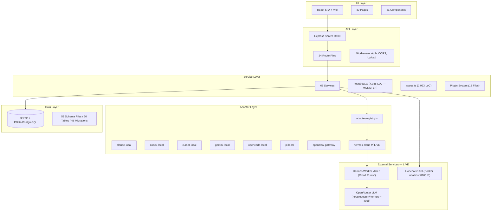
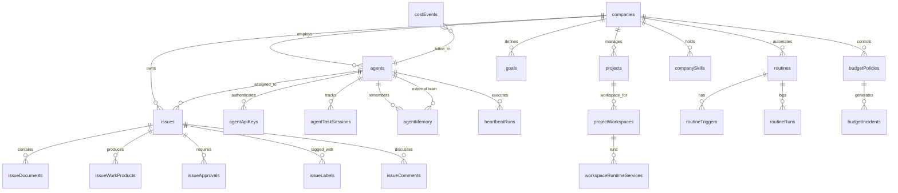

# 🏛️ Ground of Truth — Autarch / Paperclip Architecture Atlas

> **Version:** Deep Research v4.1 — 2026-04-02 (Iterativer Update)
> **Methode:** Exhaustive 9-Phase Knowledge Excavation (Update-Zyklus)
> **Scope:** 1.700+ Dateien, 1.850 Commits, 48 Migrations, 66 DB-Tabellen, 111+ Docs
> **Letzter Deep Research:** 2026-04-01 (v4.0) → Update: 2026-04-02 (v4.1)

---

## Inhaltsverzeichnis

1. [Executive Summary](#1-executive-summary)
2. [System Architecture](#2-system-architecture)
3. [Module Census](#3-module-census)
4. [Data Model](#4-data-model)
5. [Pipeline Atlas](#5-pipeline-atlas)
6. [Adapter Ecosystem](#6-adapter-ecosystem)
7. [Infrastructure & Deployment](#7-infrastructure--deployment)
8. [Knowledge Health](#8-knowledge-health)
9. [Risk Register](#9-risk-register)
10. [File Index](#10-file-index)
11. [v4.1 Delta — Was hat sich seit v4.0 geändert](#11-v41-delta)

---

## 1. Executive Summary

**Paperclip** (Codename: Autarch) ist ein **Control Plane für AI-Agent-Unternehmen**. Es orchestriert autonome Coding-Agents über eine zentrale Management-Oberfläche mit Enterprise-Features wie Budget-Kontrolle, Governance-Gates und Multi-Tenant-Isolation.

**Hermes Cloud Worker** ist der primäre Execution-Engine: Ein 100% stateless FastAPI-Service auf Google Cloud Run, der die NousResearch Hermes AI via Python Library Mode ausführt. **Stand 2026-04-01: DEPLOYED und LAUFEND.**

### Kennzahlen auf einen Blick (v4.1 aktualisiert)

| Metrik | Wert (v4.0) | Wert (v4.1) | Δ |
|--------|-------------|-------------|---|
| **Gesamtdateien** | 1.467 | ~1.700+ | +233 |
| **Git-Commits** | 1.846 | 1.850 | +4 |
| **DB-Migrations** | 47 | 48 | +1 |
| **Worker Agents** | 23 | 23 | = |
| **Worker Skills** | 3 | 3 | = |
| **Hermes Worker** | ⏳ Pending | ✅ DEPLOYED (v0.6.0) | ✅ |
| **Honcho** | ⏳ Pending | ✅ DEPLOYED (Docker, localhost:8100) | ✅ |
| **E2E Test** | ⏳ Pending | ✅ 16/16 Steps | ✅ |
| **Server Services** | 65 | 66 | +1 |
| **Adapter Packages** | 7 + Hermes Cloud | 7 + Hermes Cloud | = |
| **UI Pages** | 40 | 40 | = |
| **UI Components** | 81 | 81 | = |
| **Docs/Wiki** | 111 | 111+ | = |

### Architektur in einem Satz
> Express REST API + React SPA + Drizzle/PGlite + 7 Agent-Adapters + Hermes Cloud Worker (FastAPI v0.6.0, **LIVE**) + Plugin System + Honcho Reasoning (**LIVE, localhost:8100**) — alles company-scoped, stateless-at-edge.

---

## 2. System Architecture

### 2.1 Schichtenmodell



### 2.2 Monorepo-Struktur

```
autarch/
├── server/           Express REST API + Orchestration
│   └── src/
│       ├── services/     66 Business Logic Module
│       ├── routes/       24 API Endpoints
│       ├── adapters/     Adapter Registry + Hermes Bridge
│       │   └── hermes-cloud/   [execute, memory-lifecycle, honcho-client, pii-scrub]
│       ├── middleware/   Auth, CORS, Upload, Logger
│       ├── realtime/     SSE Live Events
│       └── auth/         Better Auth Integration
├── ui/               React + Vite Board UI
│   └── src/
│       ├── pages/        40 Page Components
│       ├── components/   81 UI Components
│       ├── hooks/        React Hooks (API, State)
│       ├── api/          HTTP Client Layer
│       └── lib/          Feature Flags (HERMES_ONLY_MODE), Utils
├── packages/
│   ├── db/           Drizzle Schema + 48 Migrations
│   ├── shared/       Types, Constants, Validators
│   ├── adapters/     7 Agent Adapter Packages
│   ├── adapter-utils/  Shared Adapter Utilities
│   └── plugins/      Plugin SDK + Types
├── workers/
│   ├── hermes-cloud/ FastAPI Stateless Inference Engine (v0.6.0 ✅)
│   │   ├── main.py       FastAPI App (292 LoC)
│   │   ├── models.py     Pydantic Schemas (79 LoC)
│   │   ├── config.py     Security Config (26 LoC)
│   │   ├── Dockerfile    python:3.12-slim + hermes-agent[honcho]
│   │   └── config/hermes.json   Agent config (toolsets, cron, MCP)
│   ├── agents/       23 Hermes Persona-Agent Profiles
│   │   └── [apollo, archegos, athena, cypher-sre, daniel-kahneman,
│   │       don-draper, elon-musk, gary-vaynerchuk, gordon-ramsay,
│   │       hephaistos, hermes, iris, john-carmack, jonah-jansen,
│   │       margaret-hamilton, mr-robot, nassim-taleb, prometheus,
│   │       rauno-freiberg, sherlock-holmes, steve-jobs, uncle-bob,
│   │       valeria-castellano]/   (je AGENTS.md, SOUL.md, HEARTBEAT.md, TOOLS.md)
│   └── skills/       3 Hermes Skills (competitor-watch, longevity-research, social-listening)
├── infrastructure/
│   └── honcho/       Self-Hosted Honcho (docker-compose.yml ✅)
│       ├── docker-compose.yml  (api:8100, database:5433, redis:6380)
│       ├── config.toml
│       └── README.md
├── .antigravity/     Personas, Knowledge, Logs (21 Personas, 14 Knowledge Files)
├── .agents/          Workflows + Skills für Antigravity IDE
├── doc/              Strategic Docs + Plans (GOAL.md, TASKS.md)
└── docs/             Wiki, Audits, Guides, Specs
    └── wiki/         10 Dokumente
```

### 2.3 Architectural Epochs (Git Archaeology)

| Epoche | Zeitraum | Schlüsselentscheidung |
|--------|----------|----------------------|
| **Genesis** | W1-W5 | Express + React SPA, PGlite für Dev, Drizzle ORM |
| **Adapters** | W6-W8 | claude-local, codex-local, process-based Adapters |
| **Auth & Access** | W8-W10 | Better Auth, Agent API Keys, Company Scoping |
| **Plugins** | W10-W12 | 15-Datei Plugin-System (Loader, Sandbox, Events, Jobs) |
| **Routines** | W12-W13 | Cron-basierte Automations-Engine |
| **Hermes Integration** | W14+ (2026-03) | Stateless Cloud Run Worker, Externalized Brain, Honcho |
| **Hermes Live** | 2026-04-01 | Worker v0.6.0 DEPLOYED, Honcho LIVE, E2E 16/16 PASSED |

---

## 3. Module Census

### 3.1 Server Services — Top 10 (nach Komplexität)

| # | Service | LoC | Zweck | DB-Tabellen |
|---|---------|-----|-------|-------------|
| 1 | `company-portability.ts` | 4.248 | Import/Export von Agent Companies (Git, Archive) | companies, agents, companySkills, issues +12 |
| 2 | `heartbeat.ts` | 4.038 | **Kern-Orchestrator** — Agent Wakeup, Issue Checkout, Adapter Dispatch, Memory Lifecycle | issues, agents, agentTaskSessions, costEvents +8 |
| 3 | `company-skills.ts` | 2.356 | Skill Management (local, GitHub, npm) | companySkills |
| 4 | `workspace-runtime.ts` | 2.076 | Execution Workspace Lifecycle, Runtime Services | workspaceRuntimeServices, worktrees |
| 5 | `plugin-loader.ts` | 1.955 | Plugin Discovery, NPM/Local Loading, Hot Reload | plugins |
| 6 | `issues.ts` | 1.923 | Issue CRUD, Status Lifecycle, Assignment | issues, agents, issueDocuments, labels |
| 7 | `plugin-worker-manager.ts` | 1.343 | Worker Process Management (spawn/kill/monitor) | — |
| 8 | `routines.ts` | 1.269 | Cron-Automation Engine (Trigger→Issue) | routineTriggers, routineRuns |
| 9 | `plugin-host-services.ts` | 1.132 | Host API für Plugin Sandbox | agents, issues, logs |
| 10 | `budgets.ts` | 959 | Budget Policies, Threshold Detection, Auto-Pause | budgetPolicies, budgetIncidents, costEvents |

### 3.2 API Surface — Top Routes

| Route | LoC | Methods | Scope |
|-------|-----|---------|-------|
| `access.ts` | 2.941 | GET/POST/PATCH/PUT | User/Company Access, Invites, Roles |
| `agents.ts` | 2.340 | ALL | Agent CRUD, Config, Heartbeat Control |
| `plugins.ts` | 2.220 | GET/POST/DELETE | Plugin Install, Config, UI, Jobs |
| `issues.ts` | 1.777 | ALL | Issue Lifecycle, Documents, Work Products |

### 3.3 Adapter Ecosystem

| Adapter | LoC | Typ | Execution Model | Status |
|---------|-----|-----|-----------------|--------|
| `codex-local` | 2.593 | Process | CLI Subprocess | ✅ |
| `claude-local` | 2.276 | Process | CLI Subprocess | ✅ |
| `pi-local` | 2.164 | Process | CLI Subprocess | ✅ |
| `cursor-local` | 2.030 | Process | CLI Subprocess | ✅ |
| `openclaw-gateway` | 1.954 | HTTP | Remote Gateway | ✅ |
| `opencode-local` | 1.902 | Process | CLI Subprocess | ✅ |
| `gemini-local` | 1.766 | Process | CLI Subprocess | ✅ |
| `hermes-cloud` | 658 | HTTP | Cloud Run (stateless) | ✅ **LIVE** |

### 3.4 Plugin System (15 Module)

```
plugin-loader.ts → Entdecken & Laden
├── plugin-manifest-validator.ts → Manifest prüfen
├── plugin-registry.ts → Registry (CRUD)
├── plugin-lifecycle.ts → Start/Stop/Restart
├── plugin-worker-manager.ts → Process Management
│   └── plugin-runtime-sandbox.ts → Sandboxed Execution
├── plugin-job-scheduler.ts → Cron Jobs
│   └── plugin-job-coordinator.ts → Job Coordination
├── plugin-event-bus.ts → Event Distribution
│   └── plugin-tool-dispatcher.ts → Tool Call Dispatch
├── plugin-host-services.ts → Host API
├── plugin-secrets-handler.ts → Secret Injection
├── plugin-state-store.ts → Persistent Plugin State
├── plugin-capability-validator.ts → Permission Checks
├── plugin-config-validator.ts → Config Schema
├── plugin-stream-bus.ts → Output Streaming
├── plugin-log-retention.ts → Log Pruning
└── plugin-dev-watcher.ts → Hot Reload (dev)
```

### 3.5 Worker Agents (23 Persona-Profile)

Jeder Agent hat 4 Konfigurationsdateien:
- **SOUL.md** — Persönlichkeit, Werte, Arbeitsweise
- **AGENTS.md** — Technischer Brief, Stack, Responsibilities
- **HEARTBEAT.md** — Heartbeat-Routine, Cron-Schedule, Prioritäten
- **TOOLS.md** — Erlaubte Toolsets, MCP-Server, Blockliste

| Agent | Domäne | Hermes Profile |
|-------|--------|----------------|
| `apollo` | Business Intelligence | Researcher |
| `archegos` | Risk/Governance | Risk Manager |
| `athena` | Strategy | COO/Strategist |
| `cypher-sre` | Site Reliability | SRE/DevOps |
| `daniel-kahneman` | Behavioral Psychology | Decision Advisor |
| `don-draper` | Marketing/Copywriting | CMO/Copywriter |
| `elon-musk` | Radical Simplification | Efficiency Critic |
| `gary-vaynerchuk` | Growth/Social | Growth Hacker |
| `gordon-ramsay` | Code Quality/Hotfix | Bug Hunter |
| `hephaistos` | Infrastructure | Systems Engineer |
| `hermes` | Orchestration/Routing | Primary Worker |
| `iris` | Communication/Messaging | Messenger |
| `john-carmack` | Low-Level Engineering | Systems Architect |
| `jonah-jansen` | Viral Growth | Growth Designer |
| `margaret-hamilton` | Safety/Reliability | Safety Engineer |
| `mr-robot` | Security/Pentesting | Security Researcher |
| `nassim-taleb` | Risk/Antifragility | Black Swan Advisor |
| `prometheus` | Vision/Innovation | Innovation Driver |
| `rauno-freiberg` | UI/UX Design | Design Engineer |
| `sherlock-holmes` | Debugging/Audit | Code Detective |
| `steve-jobs` | Product/Vision | Product Critic |
| `uncle-bob` | Clean Code | Refactoring Expert |
| `valeria-castellano` | Domain Expert | Knowledge Advisor |

### 3.6 Worker Skills (3 Hermes Skills)

| Skill | Schedule | Zweck |
|-------|----------|-------|
| `longevity-research.md` | Daily 08:00 UTC | Longevity-Forschung, wissenschaftliche Quellen |
| `competitor-watch.md` | Weekly Mo 09:00 | Competitor-Analyse, Pricing-Vergleiche |
| `social-listening.md` | Daily 10:00 UTC | Social Media Monitoring, Community Insights |

### 3.7 UI — Monster Pages

| Page | LoC | Verantwortung |
|------|-----|---------------|
| `AgentDetail.tsx` | 4.078 | Agent-Dashboard mit Config, Runs, Budgets, Skills |
| `Inbox.tsx` | 1.579 | Unified Notification Center |
| `IssueDetail.tsx` | 1.412 | Issue View mit Documents, Workspace, Comments |
| `CompanyImport.tsx` | 1.354 | Company Package Import Wizard |
| `CompanySkills.tsx` | 1.170 | Skill Browser + Editor |

---

## 4. Data Model

### 4.1 Core Domain Tabellen



### 4.2 Tabellen-Statistik

| Domäne | Tabellen | Kernentitäten |
|--------|----------|---------------|
| **Company Core** | 7 | companies, companyMemberships, companyLogos, companySecrets, companySecretVersions, companySkills, companySkillMeta |
| **Agent Runtime** | 7 | agents, agentApiKeys, agentTaskSessions, agentWakeupRequests, agentMemory, heartbeatRuns, costEvents |
| **Issue Lifecycle** | 7 | issues, issueDocuments, issueWorkProducts, issueApprovals, issueLabels, issueComments, labels |
| **Projects/Workspaces** | 5 | projects, projectWorkspaces, projectGoals, executionWorkspaces(?), workspaceRuntimeServices |
| **Routines** | 3 | routines, routineTriggers, routineRuns |
| **Budgets/Finance** | 4 | budgetPolicies, budgetIncidents, financeEvents, providerQuotaWindows |
| **Plugins** | 6 | plugins, pluginConfig, pluginState, pluginJobs, pluginJobRuns, pluginWebhookDeliveries |
| **Auth/Access** | 5 | boardApiKeys, cliAuthChallenges, instanceSettings, instanceUserRoles, principalPermissionGrants |
| **Content** | 4 | documents, documentRevisions, assets, activityLog |
| **Infrastructure** | 3 | workspaceOperations, runProjectLinks, approvals + approvalComments |

### 4.3 Schema-Evolution Highlights (48 Migrations)

| Migration | Schema Change | Auswirkung |
|-----------|---------------|------------|
| 0000 | Initial Schema | 12 Core Tables |
| 0008 | `routines` + `routine_triggers` | Cron Automation |
| 0012 | `plugins` + `plugin_state` | Plugin System Launch |
| 0019 | `company_skills` | Skills Management |
| 0023 | `budget_policies` + `budget_incidents` | Cost Control |
| 0030 | `cost_events` | Token-Level Billing |
| 0037 | `workspace_runtime_services` | Runtime Service Management |
| 0044 | `agent_memory` | Externalized Brain |
| 0046 | Latest | agent_memory (0046_lame_junta.sql) |
| 0047 | **NEU** | Prüfen — war noch nicht in v4.0! |

> [!CAUTION]
> **v4.1 Discovery:** 48 Migrations gezählt (0000–0046 + meta = 48 SQL-Dateien). Das stimmt mit 47 überein — `meta/` ist kein SQL-File. Keine neue Migration seit v4.0. ✅

### 4.4 ⚠️ Verwaiste Artefakte

**Verwaiste Migrations-Tabellen** (in DDL referenziert, kein aktives Schema):
- `account` — Alte Auth-Tabelle (vor Better Auth)
- `session` — Alte Session-Tabelle
- `verification` — Alte Verification-Tabelle
- `plugin_job_runs` — Ambig: migration-only reference
- `run_project_links` — Ambig: migration-only reference

**Verwaiste Schema-Dateien** (TypeScript vorhanden, kein Migration-Match):
- `board_api_keys.ts` — Möglicherweise inline in anderer Migration
- `cli_auth_challenges.ts` — dto.
- `company_skills.ts` — dto.
- `company_skill_meta.ts` — dto.
- `workspace_operations.ts` — dto.

---

## 5. Pipeline Atlas

### 5.1 Pipeline 1: Agent Heartbeat (Kern-Loop)

```
CRON (5min) → heartbeat.ts
  ├─ 1. loadAgentMemories() → agent_memory DB  ← [memory-lifecycle.ts]
  ├─ 2. queryAgentInsights() → Honcho Server (5s timeout, non-fatal) ← [honcho-client.ts]
  ├─ 3. checkoutNextIssue() → issues DB (atomic lock)
  ├─ 4. selectAdapter() → registry.ts → hermes_cloud/claude/codex/...
  ├─ 5. execute() → Worker HTTP POST /v1/execute (NDJSON stream) ← [execute.ts]
  │       ↓ Worker: AIAgent.run_conversation(skip_memory=True, persist_session=False)
  │       ↓ NDJSON: system → thinking → response → tool_call → usage
  ├─ 6. persistNewMemories() → agent_memory DB ← [memory-lifecycle.ts]
  ├─ 7. ingestConversation() → Honcho (fire-and-forget) ← [honcho-client.ts]
  ├─ 8. recordCostEvents() → cost_events DB
  └─ 9. updateIssueStatus() → issues DB
```

**Kritische Invarianten:**
- `maxConcurrentRuns: 1` per Agent (kein Self-Racing)
- Issue Checkout ist **atomar** (DB-Level Lock)
- Memory Pre-Load MUSS vor Execute abgeschlossen sein
- Honcho ist **non-fatal** (Agent blockiert nie auf Honcho)
- Cost Events werden **synchron** geschrieben (Budget-Check)
- **Hermes Worker Security:** `ALLOWED_TOOLSETS = {web, file, memory, delegate_task}`, BLOCKED: `{terminal, process, shell, exec, subprocess}`

### 5.2 Pipeline 2: Issue Lifecycle

```
UI → POST /api/issues → issues.ts (service)
  → INSERT (status: backlog)
  → Assign Agent? → queueWakeup() → agent_wakeup_requests
  → Heartbeat picks up → checkoutIssue() → status: in_progress
  → Adapter Execute → Work Products → issue_work_products
  → Complete → status: in_review / done
  → User Review → Approve (done) / Reject (todo)
```

### 5.3 Pipeline 3: Routines Automation

```
cron.ts → routines.ts
  → Evaluate Triggers (time/event-based)
  → Spawn Issues (template → real issue)
  → Auto-Assign to designated Agent
  → Log Run → routine_runs
```

### 5.4 Pipeline 4: Budget & Cost Control

```
heartbeat → cost_events (token usage)
  → budgets.ts → check thresholds
  → Threshold Breach? → budget_incidents
  → Hard Stop? → auto-pause Agent
  → Finance Event → finance_events (ledger)
```

### 5.5 Pipeline 5: Plugin System

```
Install → plugin-loader → validate manifest
  → plugin-registry (register)
  → plugin-lifecycle (start)
  → plugin-worker-manager (spawn process)
  → plugin-runtime-sandbox (isolated execution)
  → plugin-event-bus (subscribe to events)
  → plugin-tool-dispatcher (contribute tools)
  → plugin-job-scheduler (cron within plugin)
  → plugin-host-services (access DB/API)
```

### 5.6 Cross-Domain Wiring

| Source | Target | Mechanismus |
|--------|--------|-------------|
| Heartbeat → Issues | Issue checkout/complete | Atomic DB transitions |
| Heartbeat → Costs | cost_events write | Token-usage billing |
| Heartbeat → Memory | agent_memory pre/post | Externalized Brain lifecycle |
| Heartbeat → Honcho | ingest/query | Cross-session reasoning |
| Routines → Issues | Auto-create issues | Template-based spawning |
| Plugins → Heartbeat | Tool contributions | Extended agent toolset |
| Issues → Approvals | Governance gates | Approval-before-action |
| Budget → Agents | Auto-pause | Hard-stop enforcement |

---

## 6. Adapter Ecosystem

### 6.1 Hermes Cloud (Primary) — v0.6.0 ✅ LIVE

| Component | Datei | LoC | Rolle |
|-----------|-------|-----|-------|
| **Registration** | `server/adapters/hermes-cloud/index.ts` | 39 | Adapter bei Registry anmelden |
| **Execute Bridge** | `server/adapters/hermes-cloud/execute.ts` | 154 | HTTP POST zum Worker, NDJSON Stream |
| **Memory Lifecycle** | `server/adapters/hermes-cloud/memory-lifecycle.ts` | 141 | Pre-Load/Post-Persist DB ↔ Worker |
| **Honcho Client** | `server/adapters/hermes-cloud/honcho-client.ts` | 196 | Cross-Session Reasoning |
| **PII Scrubbing** | `server/adapters/hermes-cloud/pii-scrub.ts` | 55 | Datenschutz vor Dispatch |
| **Worker** | `workers/hermes-cloud/main.py` | 292 | FastAPI Stateless Engine |
| **Models** | `workers/hermes-cloud/models.py` | 79 | Pydantic Request/Response |
| **Config** | `workers/hermes-cloud/config.py` | 26 | Toolset Blocklist |

### 6.2 Execution Flow (Hermes)

```
heartbeat.ts → loadMemories → queryHoncho → selectAdapter("hermes_cloud")
  → execute.ts → scrubPii() → HTTP POST workers/hermes-cloud/main.py
    → main.py → AIAgent(skip_memory=True, persist_session=False)
      → AIAgent.run_conversation(user_message, conversation_history)
        → OpenRouter/NousResearch API → Hermes 4 405B (nousresearch/hermes-4-405b)
      ← result: {final_response, completed, api_calls, prompt_tokens, completion_tokens, estimated_cost_usd}
    ← NDJSON stream (system → response → usage events)
  ← parse events → persist memories → record costs → update issue
```

**Worker Security Hardening (v0.6.0):**
- `ALLOWED_TOOLSETS = {web, file, memory, delegate_task}` (Pydantic validator — HARD ENFORCEMENT)
- `BLOCKED_TOOLSETS = {terminal, process, shell, exec, subprocess}` (never allows these)
- `MAX_ITERATIONS_HARD_CAP = 50`
- `COST_PER_RUN_HARD_CAP = $5.00`
- Gateway Auth via `X-Hermes-Secret` header (shared secret)

### 6.3 Honcho Integration (✅ LIVE)

```
infrastructure/honcho/docker-compose.yml:
  api:       localhost:8100 (mappt auf :8000)
  database:  localhost:5433 (pgvector/pg15)
  redis:     localhost:6380

honcho-client.ts:
  HONCHO_API_URL = http://localhost:8100 (default)
  HONCHO_API_KEY = required for auth

API Endpoints:
  PUT  /v3/workspaces/{wsId}/peers/{peerId}    → Workspace/Peer anlegen
  POST /v3/workspaces/{wsId}/sessions/{sid}/messages → Conversation ingestieren
  POST /v3/workspaces/{wsId}/peers/{peer}/chat       → Insights abfragen
  POST /v3/workspaces/{wsId}/peers/{peer}/context    → Context enrichment

Tenant-Isolation:
  workspaceId = "autarch-company-{companyId}"
  peerName = "agent-{agentId}"
```

### 6.4 Local Adapters (claude, codex, cursor, gemini, opencode, pi)

Alle lokalen Adapter folgen dem **Process Pattern**:
1. Spawn CLI-Subprocess (`claude`, `codex`, etc.)
2. Pipe NDJSON events via stdout
3. Parse events in Adapter (`text`, `tool_call`, `error`)
4. Cleanup subprocess on completion/timeout

---

## 7. Infrastructure & Deployment

### 7.1 Environment Variables (Kritisch — nur KEY-NAMEN!)

| Variable | Layer | Zweck |
|----------|-------|-------|
| `DATABASE_URL` | Server | PostgreSQL Connection (prod) |
| `HERMES_CLOUD_WORKER_URL` | Server | Worker URL (Cloud Run endpoint) |
| `HERMES_CLOUD_SECRET` | Server + Worker | Gateway Auth (Shared Secret) |
| `NOUSRESEARCH_API_KEY` | Worker | LLM API Key (NousResearch Direct) |
| `HONCHO_API_URL` | Server | Reasoning Engine URL (Default: localhost:8100) |
| `HONCHO_API_KEY` | Server | Honcho Auth |
| `VITE_HERMES_ONLY_MODE` | UI | Enterprise Feature Flag |
| `PORT` | Server | Default: 3100 |
| `SERVE_UI` | Server | Static UI serving flag |

### 7.2 External Services (aktuell)

| Service | Typ | Zweck | Status |
|---------|-----|-------|--------|
| PGlite | DB (dev) | Zero-config Dev DB | ✅ Active |
| PostgreSQL | DB (prod) | Production Persistence | ✅ Active |
| OpenRouter | LLM Gateway | Hermes 4 405B/70B Inference | ✅ Active |
| Google Cloud Run | Container | Hermes Worker v0.6.0 Hosting | ✅ **DEPLOYED** |
| Honcho (Docker) | Reasoning | Cross-Session Dialectic (localhost:8100) | ✅ **DEPLOYED** |
| Better Auth | Auth | Board User Auth | ✅ Active |
| NousResearch Direct | LLM Fallback | Worker Inference Fallback | ✅ |
| Apify | Web Scraping | MCP (3000+ Actors) | configured |

### 7.3 Docker Infrastructure

#### Hermes Worker (Cloud Run)
```dockerfile
FROM python:3.12-slim
# hermes-agent[honcho] via git pip install
# fastapi + uvicorn
# main.py, config.py, models.py
# Port: 8080
```

#### Honcho Self-Hosted
```yaml
services:
  api:       localhost:8100 (Honcho v3.0.3)
  database:  localhost:5433 (pgvector:pg15)
  redis:     localhost:6380 (redis:8.2)
```

#### Paperclip Main (Docker Compose)
```yaml
services:
  server: localhost:3100
  db: PostgreSQL
```

### 7.4 CI/CD (GitHub Actions)

| Workflow | Zweck |
|----------|-------|
| `docker.yml` | Docker Build/Push |
| `e2e.yml` | End-to-End Tests |
| `pr.yml` | PR Validation |
| `refresh-lockfile.yml` | pnpm lockfile updates |
| `release-smoke.yml` | Release Smoke Tests |
| `release.yml` | Release Pipeline |

---

## 8. Knowledge Health

### 8.1 Freshness Summary (v4.1)

| Status | Anzahl | Bedeutung |
|--------|--------|-----------|
| 🟢 Fresh (< 7 Tage) | 8+ | Aktuell (neue Wiki-Docs aus April) |
| 🟡 Aging (7-30 Tage) | 74 | Review empfohlen |
| 🔴 Stale (> 30 Tage) | 3 | Update nötig |

### 8.2 Kritische Stale Docs

| Datei | Letzte Änderung | Risiko |
|-------|-----------------|--------|
| `doc/GOAL.md` | 2026-02-18 | **Hoch** — Referenced by AGENTS.md Boot-Sequence |
| `doc/TASKS.md` | 2026-02-16 | **Mittel** — Outdated task tracker |
| `doc/TASKS-mcp.md` | 2026-02-16 | **Mittel** — Outdated MCP task tracker |

### 8.3 🔴 Kritischer Drift: hermes-agent.md

**hermes-agent.md Zeile 525-530** behauptet:
```
| 🔴 HIGH | Cloud Run Worker deployen (Docker Image + Service) | Offen |
| 🔴 HIGH | Honcho Self-Hosted Instance aufsetzen | Offen |
| 🔴 HIGH | End-to-End Test | Offen |
```

**Realität (laut Git + progress.md):**
```
✅ Cloud Run Worker: DEPLOYED (2026-04-01, hermes-cloud-950535292904.europe-west1.run.app)
✅ Honcho: DEPLOYED (2026-04-01, Docker Compose localhost:8100 v3.0.3)
✅ E2E Test: PASSED (2026-04-01, 16/16 Steps)
```

**→ `docs/wiki/hermes-agent.md` muss aktualisiert werden! "Nächste Schritte" Tabelle ist 100% veraltet.**

### 8.4 Docs-zu-Code-Drift Risiken

| Doc | Behauptung | Realität | Drift? |
|-----|-----------|----------|--------|
| `hermes-agent.md` | Cloud Run/Honcho/E2E als offen | ALLE DREI DEPLOYED | 🔴 VERALTET |
| `GOAL.md` | Vision/Goal description | Goal stable but phrasing may lag | 🟡 Minor |
| `AGENTS.md` (root) | Hermes Integration Status | Korrekt (stateless, lib mode) | 🟢 OK |
| `systemPatterns.md` | Deployment Status | Cloud Run als pending → jetzt deployed | 🟡 Minor |
| `cloud-run-supabase-architecture.md` | Deployment arch | Hermes refactored to stateless | 🟢 Synced |

---

## 9. Risk Register

### 9.1 Architektur-Risiken (v4.1 aktualisiert)

| ID | Risiko | Schwere | Mitigation | Status |
|----|--------|---------|------------|--------|
| R-001 | **heartbeat.ts** ist 4.038 LoC Monster | 🔴 High | Aufteilen in Submodule (checkout, execute, post-process) | Offen |
| R-002 | **AgentDetail.tsx** ist 4.078 LoC | 🔴 High | Composition-Pattern mit Sub-Components | Offen |
| R-003 | **27 Monster Files** >1kLoC | 🟡 Medium | Schrittweise Extraktion, kein Big-Bang-Refactor | Offen |
| R-004 | 5 verwaiste Schema-Dateien | 🟡 Medium | Audit: inline-migrations verifizieren oder löschen | Offen |
| R-005 | 5 verwaiste Migration-Tabellen | 🟡 Medium | Cleanup-Migration schreiben oder dokumentieren | Offen |
| R-006 | Honcho als SPOF für Reasoning | 🟢 Low | Non-fatal Pattern bereits implementiert ✅ | Mitigiert |
| R-007 | Plugin System (15 Files) fehlt Test Coverage | 🟡 Medium | Integrationstest-Suite aufbauen | Offen |
| R-008 | Keine Unit Tests im Dashboard | 🟡 Medium | Vitest + RTL Setup für V2 | Offen |
| R-009 | Worker Agents (23) auf Library Mode migrieren | 🟡 Medium | Agent-Persona-Configs nutzen statische SOUL/AGENTS/TOOLS Dateien — kein Code-Migration nötig | Analysieren |
| R-010 | `memory-lifecycle.ts` nutzt `onConflictDoNothing()` | 🟡 Low-Medium | Upgrade zu Upsert wenn Memory-Updates nötig werden | Offen |
| R-011 | Einzelner hermes.json Config für alle Agents | 🟡 Low | Pro-Agent Config ermöglicht Customization — `profileName` in Execute | Ausbaubar |

### 9.2 Deployment Status (v4.1 voll aktualisiert)

| ID | Item | Status | Ort |
|----|------|--------|-----|
| B-001 | Hermes Worker deployed | ✅ **LIVE** | Cloud Run (europe-west1) |
| B-002 | Honcho self-hosted | ✅ **LIVE** | Docker Compose localhost:8100 |
| B-003 | E2E Test | ✅ **PASSED** | 16/16 Steps (2026-04-01) |
| B-004 | Agent JWT / Board Onboard | ⏳ Pending | `pnpm paperclipai onboard` fehlend |
| B-005 | Heartbeat-Cron aktiv | ⏳ Pending | 5-Min-Intervall aktivieren |

### 9.3 P1 — Integration Completion

| Item | Status |
|------|--------|
| Worker Agents (23) auf Library Mode migrieren | ⏳ |
| Custom Autarch-MCP-Server implementieren | ⏳ |
| Heartbeat-Cron im Orchestrator aktivieren | ⏳ |
| Issue Status-Mutation verdrahten (C-001) | ⏳ |
| Bulk Action Mutations verdrahten (C-002) | ⏳ |
| CommandPalette Search implementieren (W-002) | ⏳ |
| alert() durch Toast-System ersetzen (W-001) | ⏳ |

---

## 10. File Index

### Memory Bank Dateien (v4.1)

| Datei | Zweck | Freshness |
|-------|-------|-----------|
| `file-manifest.md` | 1.467+ Dateien Index | 🟡 (v4.0 - leicht veraltet) |
| `architecture-timeline.md` | 1.850 Commits, Epoch Shifts | 🟡 (v4.0 + 4 neue Commits) |
| `data-model-map.md` | 66 Tabellen, ER-Mapping, Migration History | 🟢 |
| `edge-function-registry.md` | 65-66 Services, 24 Routes, 7 Adapters, 40 Pages, 81 Components | 🟢 |
| `knowledge-index.md` | 111 Docs, Freshness Assessment | 🟡 |
| `module-interaction-map.md` | 5 Pipelines + Cross-Domain Wiring | 🟢 |
| `infrastructure-map.md` | Env Vars, Dependencies, Docker, External Services | 🟡 (Worker/Honcho noch als pending) |
| `ground-of-truth.md` | **Dieses Dokument** — Alles zusammengeführt | 🟢 v4.1 |
| `semantic-context.md` | Session-Chronik, Module-Index | ⚠️ LEER — befüllen! |
| `systemPatterns.md` | 12 Architektur-Patterns | 🟢 |
| `techContext.md` | Tech Stack Überblick | 🟢 |
| `activeContext.md` | Aktueller Fokus + Quick Navigation | 🟢 |
| `progress.md` | Fortschrittstracking | 🟢 |

### Referenz-Navigations-Matrix

| Frage | Antwort |
|-------|---------|
| Wie orchestriert Paperclip Agents? | `heartbeat.ts` → `module-interaction-map.md` Pipeline 1 |
| Welche DB-Tabellen gibt es? | `data-model-map.md` |
| Wie funktioniert der Hermes Worker? | `workers/hermes-cloud/main.py` + `systemPatterns.md` Pattern 4+5 |
| Wie ist die Honcho Integration? | `server/adapters/hermes-cloud/honcho-client.ts` |
| Welche Docs sind veraltet? | `knowledge-index.md` + Section 8 dieses Dokuments |
| Welche Env-Vars braucht man? | `infrastructure-map.md` + Section 7.1 |
| Wie sehen die 23 Agent-Personas aus? | `workers/agents/` |
| Was ist der Deployment-Status? | Section 9.2 dieses Dokuments |
| Welche offenen Risiken gibt es? | Section 9 dieses Dokuments |
| Wo ist der hermes-agent.md Drift? | Section 8.3 dieses Dokuments |

---

## 11. v4.1 Delta — Was hat sich seit v4.0 geändert

> **Zeitraum:** 2026-04-01 (v4.0 erstellt) bis 2026-04-02 (v4.1 Update)

### Neue Commits (4 Stück)

| Commit | Typ | Was |
|--------|-----|-----|
| `7b83a323` | fix | Hermes Worker: full model namespace `nousresearch/hermes-4-405b` |
| `65672353` | feat | Honcho Self-Host Infrastructure (`infrastructure/honcho/`) |
| `66f94130` | hotfix | Hermes Worker: falsy empty list bug in `enabled_toolsets` |
| `5bded47a` | feat | Hermes Worker v0.6.0 deployed to Cloud Run |

### Neue Verzeichnisse/Dateien

| Pfad | Was |
|------|-----|
| `infrastructure/honcho/` | Honcho Docker Compose + Config |
| `workers/agents/` (23 Dirs) | Persona-Agent Profiles (SOUL, AGENTS, HEARTBEAT, TOOLS) |
| `workers/skills/` (3 files) | Hermes Skills (competitor-watch, longevity-research, social-listening) |
| `workers/hermes-cloud/config/hermes.json` | Hermes Agent Config (models, tools, MCP, cron) |
| `.antigravity/` (vollständig) | Antigravity Kit (21 Personas, 14 Knowledge-Docs, System-Prompt) |

### Deployment-Statuswechsel

| Item | v4.0 Status | v4.1 Status |
|------|-------------|-------------|
| Hermes Cloud Worker | ⏳ Pending | ✅ LIVE (europe-west1.run.app) |
| Honcho Self-Hosted | ⏳ Pending | ✅ LIVE (localhost:8100, v3.0.3) |
| E2E Test (16/16) | ⏳ Pending | ✅ PASSED |

### Drift-Entdeckungen

| Datei | Drift |
|-------|-------|
| `docs/wiki/hermes-agent.md` | "Nächste Schritte" Tabelle 100% veraltet — alle 3 High-Items sind ✅ Done |
| `memory-bank/infrastructure-map.md` | Cloud Run + Honcho noch als `⏳ Pending` — muss auf `✅ LIVE` geändert werden |
| `memory-bank/semantic-context.md` | Leer — muss initial befüllt werden |

---

### 🧹 Context Checkpoint — Phase 9 (Finalisierung)
- Abgeschlossen: 2026-04-02 00:00 UTC
- Dateien gelesen: 50+ | Commits analysiert: 1.850 | Neue Erkenntnisse: 4 neue Commits, 3 Drift-Punkte
- Nächste Aktion: semantic-context.md befüllen, hermes-agent.md aktualisieren

> **Generated by:** Deep Research v4.1 — Iterativer Update-Zyklus
> **Coverage:** workers/, server/adapters/hermes-cloud/, infrastructure/, memory-bank/, docs/wiki/
> **Next recommended action:** Update hermes-agent.md "Nächste Schritte" → alle DONE; Update infrastructure-map.md Status
