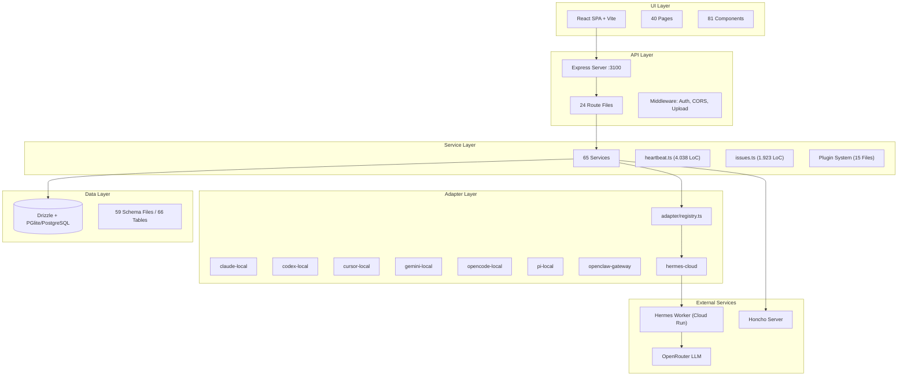
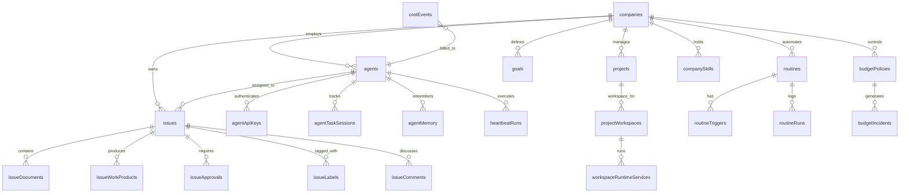

# 🏛️ Ground of Truth — Autarch / Paperclip Architecture Atlas

> **Version:** Deep Research v4 — 2026-04-01
> **Methode:** Exhaustive 9-Phase Knowledge Excavation
> **Scope:** 1.467 Dateien, 1.846 Commits, 47 Migrations, 66 DB-Tabellen, 111 Docs

---

## Inhaltsverzeichnis

1. [Executive Summary](#1-executive-summary)
2. [System Architecture](#2-system-architecture)
3. [Module Census](#3-module-census)
4. [Data Model](#4-data-model)
5. [Pipeline Atlas](#5-pipeline-atlas)
6. [Adapter Ecosystem](#6-adapter-ecosystem)
7. [Infrastructure & Deployment](#7-infrastructure--deployment)
8. [Knowledge Health](#8-knowledge-health)
9. [Risk Register](#9-risk-register)
10. [File Index](#10-file-index)

---

## 1. Executive Summary

**Paperclip** (Codename: Autarch) ist ein **Control Plane für AI-Agent-Unternehmen**. Es orchestriert autonome Coding-Agents über eine zentrale Management-Oberfläche mit Enterprise-Features wie Budget-Kontrolle, Governance-Gates und Multi-Tenant-Isolation.

### Kennzahlen auf einen Blick

| Metrik | Wert |
|--------|------|
| **Gesamtdateien** | 1.467 |
| **Git-Commits** | 1.846 (68 Contributors) |
| **Server Services** | 65 (36.323 Zeilen) |
| **API Routes** | 24 Dateien (14.131 Zeilen) |
| **Adapter Packages** | 7 + Hermes Cloud (server-side) |
| **UI Pages** | 40 (24.338 Zeilen) |
| **UI Components** | 81 (21.252 Zeilen) |
| **DB-Tabellen** | 66 (aktiv: ~61, verwaist: 5) |
| **SQL Migrations** | 47 (0000 → 0046) |
| **Schema Files** | 59 TypeScript |
| **Docs/Wiki** | 111 Markdown-Dateien |
| **Monster Files (>1kLoC)** | 27 |

### Architektur in einem Satz
> Express REST API + React SPA + Drizzle/PGlite + 7 Agent-Adapters + Hermes Cloud Worker (FastAPI) + Plugin System + Honcho Reasoning — alles company-scoped, stateless-at-edge.

---

## 2. System Architecture

### 2.1 Schichtenmodell



### 2.2 Monorepo-Struktur

```
autarch/
├── server/           Express REST API + Orchestration
│   └── src/
│       ├── services/     65 Business Logic Module
│       ├── routes/       24 API Endpoints
│       ├── adapters/     Adapter Registry + Hermes Bridge
│       ├── middleware/   Auth, CORS, Upload
│       ├── realtime/     SSE Live Events
│       └── auth/         Better Auth Integration
├── ui/               React + Vite Board UI
│   └── src/
│       ├── pages/        40 Page Components
│       ├── components/   81 UI Components
│       ├── hooks/        React Hooks (API, State)
│       ├── api/          HTTP Client Layer
│       └── lib/          Feature Flags, Utils
├── packages/
│   ├── db/           Drizzle Schema + Migrations
│   ├── shared/       Types, Constants, Validators
│   ├── adapters/     7 Agent Adapter Packages
│   ├── adapter-utils/  Shared Adapter Utilities
│   └── plugins/      Plugin SDK + Types
├── workers/
│   └── hermes-cloud/  FastAPI Stateless Inference Engine
└── doc/              Strategic Docs + Plans
```

### 2.3 Architectural Epochs (aus Git Archaeology)

| Epoche | Zeitraum | Schlüsselentscheidung |
|--------|----------|----------------------|
| **Genesis** | W1-W5 | Express + React SPA, PGlite für Dev, Drizzle ORM |
| **Adapters** | W6-W8 | claude-local, codex-local, process-based Adapters |
| **Auth & Access** | W8-W10 | Better Auth, Agent API Keys, Company Scoping |
| **Plugins** | W10-W12 | 15-Datei Plugin-System (Loader, Sandbox, Events, Jobs) |
| **Routines** | W12-W13 | Cron-basierte Automations-Engine |
| **Hermes Integration** | W14+ | Stateless Cloud Run Worker, Externalized Brain, Honcho |

---

## 3. Module Census

### 3.1 Server Services — Top 10 (nach Komplexität)

| # | Service | LoC | Zweck | DB-Tabellen |
|---|---------|-----|-------|-------------|
| 1 | `company-portability.ts` | 4.248 | Import/Export von Agent Companies (Git, Archive) | companies, agents, companySkills, issues +12 |
| 2 | `heartbeat.ts` | 4.038 | **Kern-Orchestrator** — Agent Wakeup, Issue Checkout, Adapter Dispatch, Memory Lifecycle | issues, agents, agentTaskSessions, costEvents +8 |
| 3 | `company-skills.ts` | 2.356 | Skill Management (local, GitHub, npm) | companySkills |
| 4 | `workspace-runtime.ts` | 2.076 | Execution Workspace Lifecycle, Runtime Services | workspaceRuntimeServices, worktrees |
| 5 | `plugin-loader.ts` | 1.955 | Plugin Discovery, NPM/Local Loading, Hot Reload | plugins |
| 6 | `issues.ts` | 1.923 | Issue CRUD, Status Lifecycle, Assignment | issues, agents, issueDocuments, labels |
| 7 | `plugin-worker-manager.ts` | 1.343 | Worker Process Management (spawn/kill/monitor) | — |
| 8 | `routines.ts` | 1.269 | Cron-Automation Engine (Trigger→Issue) | routineTriggers, routineRuns |
| 9 | `plugin-host-services.ts` | 1.132 | Host API für Plugin Sandbox | agents, issues, logs |
| 10 | `budgets.ts` | 959 | Budget Policies, Threshold Detection, Auto-Pause | budgetPolicies, budgetIncidents, costEvents |

### 3.2 API Surface — Top Routes

| Route | LoC | Methods | Scope |
|-------|-----|---------|-------|
| `access.ts` | 2.941 | GET/POST/PATCH/PUT | User/Company Access, Invites, Roles |
| `agents.ts` | 2.340 | ALL | Agent CRUD, Config, Heartbeat Control |
| `plugins.ts` | 2.220 | GET/POST/DELETE | Plugin Install, Config, UI, Jobs |
| `issues.ts` | 1.777 | ALL | Issue Lifecycle, Documents, Work Products |

### 3.3 Adapter Ecosystem

| Adapter | LoC | Typ | Execution Model |
|---------|-----|-----|-----------------|
| `codex-local` | 2.593 | Process | CLI Subprocess |
| `claude-local` | 2.276 | Process | CLI Subprocess |
| `pi-local` | 2.164 | Process | CLI Subprocess |
| `cursor-local` | 2.030 | Process | CLI Subprocess |
| `openclaw-gateway` | 1.954 | HTTP | Remote Gateway |
| `opencode-local` | 1.902 | Process | CLI Subprocess |
| `gemini-local` | 1.766 | Process | CLI Subprocess |
| `hermes-cloud` | 664 | HTTP | Cloud Run (stateless) |

### 3.4 Plugin System (15 Module)

```
plugin-loader.ts → Entdecken & Laden
├── plugin-manifest-validator.ts → Manifest prüfen
├── plugin-registry.ts → Registry (CRUD)
├── plugin-lifecycle.ts → Start/Stop/Restart
├── plugin-worker-manager.ts → Process Management
│   └── plugin-runtime-sandbox.ts → Sandboxed Execution
├── plugin-job-scheduler.ts → Cron Jobs
│   └── plugin-job-coordinator.ts → Job Coordination
├── plugin-event-bus.ts → Event Distribution
│   └── plugin-tool-dispatcher.ts → Tool Call Dispatch
├── plugin-host-services.ts → Host API
├── plugin-secrets-handler.ts → Secret Injection
├── plugin-state-store.ts → Persistent Plugin State
├── plugin-capability-validator.ts → Permission Checks
├── plugin-config-validator.ts → Config Schema
├── plugin-stream-bus.ts → Output Streaming
├── plugin-log-retention.ts → Log Pruning
└── plugin-dev-watcher.ts → Hot Reload (dev)
```

### 3.5 UI — Monster Pages

| Page | LoC | Verantwortung |
|------|-----|---------------|
| `AgentDetail.tsx` | 4.078 | Agent-Dashboard mit Config, Runs, Budgets, Skills |
| `Inbox.tsx` | 1.579 | Unified Notification Center |
| `IssueDetail.tsx` | 1.412 | Issue View mit Documents, Workspace, Comments |
| `CompanyImport.tsx` | 1.354 | Company Package Import Wizard |
| `CompanySkills.tsx` | 1.170 | Skill Browser + Editor |

---

## 4. Data Model

### 4.1 Core Domain Tabellen



### 4.2 Tabellen-Statistik

| Domäne | Tabellen | Kernentitäten |
|--------|----------|---------------|
| **Company Core** | 7 | companies, companyMemberships, companyLogos, companySecrets, companySecretVersions, companySkills, companySkillMeta |
| **Agent Runtime** | 7 | agents, agentApiKeys, agentTaskSessions, agentWakeupRequests, agentMemory, heartbeatRuns, costEvents |
| **Issue Lifecycle** | 7 | issues, issueDocuments, issueWorkProducts, issueApprovals, issueLabels, issueComments, labels |
| **Projects/Workspaces** | 5 | projects, projectWorkspaces, projectGoals, executionWorkspaces(?), workspaceRuntimeServices |
| **Routines** | 3 | routines, routineTriggers, routineRuns |
| **Budgets/Finance** | 4 | budgetPolicies, budgetIncidents, financeEvents, providerQuotaWindows |
| **Plugins** | 6 | plugins, pluginConfig, pluginState, pluginJobs, pluginJobRuns, pluginWebhookDeliveries |
| **Auth/Access** | 5 | boardApiKeys, cliAuthChallenges, instanceSettings, instanceUserRoles, principalPermissionGrants |
| **Content** | 4 | documents, documentRevisions, assets, activityLog |
| **Infrastructure** | 3 | workspaceOperations, runProjectLinks, approvals + approvalComments |

### 4.3 Schema-Evolution Highlights

| Migration | Schema Change | Auswirkung |
|-----------|---------------|------------|
| 0000 | Initial Schema | 12 Core Tables |
| 0008 | `routines` + `routine_triggers` | Cron Automation |
| 0012 | `plugins` + `plugin_state` | Plugin System Launch |
| 0019 | `company_skills` | Skills Management |
| 0023 | `budget_policies` + `budget_incidents` | Cost Control |
| 0030 | `cost_events` | Token-Level Billing |
| 0037 | `workspace_runtime_services` | Runtime Service Management |
| 0044 | `agent_memory` | Externalized Brain |
| 0046 | Latest | Schema current |

### 4.4 ⚠️ Verwaiste Artefakte

**Verwaiste Migrations-Tabellen** (in DDL referenziert, kein aktives Schema):
- `account` — Alte Auth-Tabelle (vor Better Auth)
- `session` — Alte Session-Tabelle
- `verification` — Alte Verification-Tabelle
- `plugin_job_runs` — Ambig: migration-only reference
- `run_project_links` — Ambig: migration-only reference

**Verwaiste Schema-Dateien** (TypeScript vorhanden, kein Migration-Match):
- `board_api_keys.ts` — Möglicherweise inline in anderer Migration
- `cli_auth_challenges.ts` — dto.
- `company_skills.ts` — dto.
- `company_skill_meta.ts` — dto.
- `workspace_operations.ts` — dto.

---

## 5. Pipeline Atlas

### 5.1 Pipeline 1: Agent Heartbeat (Kern-Loop)

```
CRON (5min) → heartbeat.ts
  ├─ 1. loadAgentMemories() → agent_memory DB
  ├─ 2. queryAgentInsights() → Honcho Server (5s timeout, non-fatal)
  ├─ 3. checkoutNextIssue() → issues DB (atomic lock)
  ├─ 4. selectAdapter() → registry.ts → hermes_cloud/claude/codex/...
  ├─ 5. execute() → Worker/CLI → NDJSON event stream
  ├─ 6. persistNewMemories() → agent_memory DB
  ├─ 7. ingestConversation() → Honcho (fire-and-forget)
  ├─ 8. recordCostEvents() → cost_events DB
  └─ 9. updateIssueStatus() → issues DB
```

**Kritische Invarianten:**
- `maxConcurrentRuns: 1` per Agent (kein Self-Racing)
- Issue Checkout ist **atomar** (DB-Level Lock)
- Memory Pre-Load MUSS vor Execute abgeschlossen sein
- Honcho ist **non-fatal** (Agent blockiert nie auf Honcho)
- Cost Events werden **synchron** geschrieben (Budget-Check)

### 5.2 Pipeline 2: Issue Lifecycle

```
UI → POST /api/issues → issues.ts (service)
  → INSERT (status: backlog)
  → Assign Agent? → queueWakeup() → agent_wakeup_requests
  → Heartbeat picks up → checkoutIssue() → status: in_progress
  → Adapter Execute → Work Products → issue_work_products
  → Complete → status: in_review / done
  → User Review → Approve (done) / Reject (todo)
```

### 5.3 Pipeline 3: Routines Automation

```
cron.ts → routines.ts
  → Evaluate Triggers (time/event-based)
  → Spawn Issues (template → real issue)
  → Auto-Assign to designated Agent
  → Log Run → routine_runs
```

### 5.4 Pipeline 4: Budget & Cost Control

```
heartbeat → cost_events (token usage)
  → budgets.ts → check thresholds
  → Threshold Breach? → budget_incidents
  → Hard Stop? → auto-pause Agent
  → Finance Event → finance_events (ledger)
```

### 5.5 Pipeline 5: Plugin System

```
Install → plugin-loader → validate manifest
  → plugin-registry (register)
  → plugin-lifecycle (start)
  → plugin-worker-manager (spawn process)
  → plugin-runtime-sandbox (isolated execution)
  → plugin-event-bus (subscribe to events)
  → plugin-tool-dispatcher (contribute tools)
  → plugin-job-scheduler (cron within plugin)
  → plugin-host-services (access DB/API)
```

### 5.6 Cross-Domain Wiring

| Source | Target | Mechanismus |
|--------|--------|-------------|
| Heartbeat → Issues | Issue checkout/complete | Atomic DB transitions |
| Heartbeat → Costs | cost_events write | Token-usage billing |
| Routines → Issues | Auto-create issues | Template-based spawning |
| Plugins → Heartbeat | Tool contributions | Extended agent toolset |
| Issues → Approvals | Governance gates | Approval-before-action |
| Budget → Agents | Auto-pause | Hard-stop enforcement |

---

## 6. Adapter Ecosystem

### 6.1 Hermes Cloud (Primary)

| Component | Datei | LoC | Rolle |
|-----------|-------|-----|-------|
| **Registration** | `server/adapters/hermes-cloud/index.ts` | 40 | Adapter bei Registry anmelden |
| **Execute Bridge** | `server/adapters/hermes-cloud/execute.ts` | 155 | HTTP POST zum Worker, NDJSON Stream |
| **Memory Lifecycle** | `server/adapters/hermes-cloud/memory-lifecycle.ts` | 142 | Pre-Load/Post-Persist DB ↔ Worker |
| **Honcho Client** | `server/adapters/hermes-cloud/honcho-client.ts` | 197 | Cross-Session Reasoning |
| **PII Scrubbing** | `server/adapters/hermes-cloud/pii-scrub.ts` | 56 | Datenschutz vor Dispatch |
| **Worker** | `workers/hermes-cloud/main.py` | 290 | FastAPI Stateless Engine |
| **Models** | `workers/hermes-cloud/models.py` | 78 | Pydantic Request/Response |
| **Config** | `workers/hermes-cloud/config.py` | 25 | Toolset Blocklist |

### 6.2 Execution Flow (Hermes)

```
heartbeat.ts → loadMemories → queryHoncho → selectAdapter("hermes_cloud")
  → execute.ts → scrubPii() → HTTP POST workers/hermes-cloud/main.py
    → main.py → load model config → AIAgent.run_conversation(skip_memory=True)
      → OpenRouter API → Hermes 4 405B/70B
    ← NDJSON stream (events: text, tool_call, save_memory, usage)
  ← parse events → persist memories → record costs → update issue
```

### 6.3 Local Adapters (claude, codex, cursor, gemini, opencode, pi)

Alle lokalen Adapter folgen dem **Process Pattern**:
1. Spawn CLI-Subprocess (`claude`, `codex`, etc.)
2. Pipe NDJSON events via stdout
3. Parse events in Adapter (`text`, `tool_call`, `error`)
4. Cleanup subprocess on completion/timeout

---

## 7. Infrastructure & Deployment

### 7.1 Environment Variables (Kritisch)

| Variable | Layer | Zweck |
|----------|-------|-------|
| `DATABASE_URL` | Server | PostgreSQL Connection (prod) |
| `HERMES_CLOUD_SECRET` | Server + Worker | Gateway Auth (Shared Secret) |
| `NOUSRESEARCH_API_KEY` | Worker | LLM API Key (OpenRouter) |
| `HONCHO_API_URL` | Server | Reasoning Engine URL |
| `HONCHO_API_KEY` | Server | Honcho Auth |
| `VITE_HERMES_ONLY_MODE` | UI | Enterprise Feature Flag |
| `OPENROUTER_API_KEY` | Worker (fallback) | Alternative LLM API Key |
| `PORT` | Server | Default: 3100 |

### 7.2 External Services

| Service | Typ | Zweck | Status |
|---------|-----|-------|--------|
| PGlite | DB (dev) | Zero-config Dev DB | ✅ Active |
| PostgreSQL | DB (prod) | Production Persistence | ✅ Active |
| OpenRouter | LLM Gateway | Hermes 4 405B/70B Inference | ✅ Active |
| Google Cloud Run | Container | Hermes Worker Hosting | ⏳ Pending Deploy |
| Honcho | Reasoning | Cross-Session Dialectic | ⏳ Pending Self-Host |
| Better Auth | Auth | Board User Auth | ✅ Active |

### 7.3 Dev Setup

```bash
# Zero-config (PGlite, kein DATABASE_URL nötig)
pnpm install
pnpm dev
# → API: http://localhost:3100
# → UI: http://localhost:3100 (served by API)
```

### 7.4 Docker

- **Base Image:** `node:22-slim`
- **Exposed Port:** `3100`
- **Compose Services:** `paperclip`, `db` (PostgreSQL)

---

## 8. Knowledge Health

### 8.1 Freshness Summary

| Status | Anzahl | Bedeutung |
|--------|--------|-----------|
| 🟢 Fresh (<7 Tage) | 6 | Aktuell |
| 🟡 Aging (7-30 Tage) | 74 | Review empfohlen |
| 🔴 Stale (>30 Tage) | 3 | Update nötig |
| ❓ Untracked | 28 | Keine Git-History (Memory Bank) |

### 8.2 Kritische Stale Docs

| Datei | Letzte Änderung | Risiko |
|-------|-----------------|--------|
| `doc/GOAL.md` | 2026-02-18 | **Hoch** — Referenced by AGENTS.md Boot-Sequence |
| `doc/TASKS.md` | 2026-02-16 | **Mittel** — Outdated task tracker |
| `doc/TASKS-mcp.md` | 2026-02-16 | **Mittel** — Outdated MCP task tracker |

### 8.3 Docs-zu-Code-Drift Risiken

| Doc | Behauptung | Realität | Drift? |
|-----|-----------|----------|--------|
| `GOAL.md` | Vision/Goal description | Goal stable but phrasing may lag | 🟡 Minor |
| `SPEC-implementation.md` | V1 build contract | Plugin system evolved significantly | 🟡 Possible |
| `ux-architecture.md` | UI structure | 40 pages vs. documented subset | 🟡 Incomplete |
| `cloud-run-supabase-architecture.md` | Deployment arch | Hermes refactored to stateless | ✅ Synced |

---

## 9. Risk Register

### 9.1 Architektur-Risiken

| ID | Risiko | Schwere | Mitigation |
|----|--------|---------|------------|
| R-001 | **heartbeat.ts** ist 4.038 LoC Monster | 🔴 High | Aufteilen in Submodule (checkout, execute, post-process) |
| R-002 | **AgentDetail.tsx** ist 4.078 LoC | 🔴 High | Composition-Pattern mit Sub-Components |
| R-003 | **27 Monster Files** >1kLoC | 🟡 Medium | Schrittweise Extraktion, kein Big-Bang-Refactor |
| R-004 | 5 verwaiste Schema-Dateien | 🟡 Medium | Audit: inline-migrations verifizieren oder löschen |
| R-005 | 5 verwaiste Migration-Tabellen | 🟡 Medium | Cleanup-Migration schreiben oder dokumentieren |
| R-006 | Honcho als SPOF für Reasoning | 🟢 Low | Non-fatal Pattern bereits implementiert |
| R-007 | Plugin System (15 Files) fehlt Test Coverage | 🟡 Medium | Integrationstest-Suite aufbauen |
| R-008 | Keine Unit Tests im Dashboard | 🟡 Medium | Vitest + RTL Setup für V2 |

### 9.2 Deployment-Blocker

| ID | Blocker | Status | Nächster Schritt |
|----|---------|--------|-----------------|
| B-001 | Hermes Worker nicht deployed | ⏳ Pending | Docker Build → Cloud Run Deploy |
| B-002 | Honcho nicht self-hosted | ⏳ Pending | Docker Compose aufsetzen |
| B-003 | E2E Test nicht ausgeführt | ⏳ Pending | Task → Heartbeat → Worker → Memory → Honcho |

---

## 10. File Index

### Memory Bank Dateien

| Datei | Zweck | Phase |
|-------|-------|-------|
| `file-manifest.md` | 1.467 Dateien Index | Phase 0 |
| `architecture-timeline.md` | 1.846 Commits, Epoch Shifts | Phase 1 |
| `data-model-map.md` | 66 Tabellen, ER-Mapping, Migration History | Phase 2 |
| `edge-function-registry.md` | 65 Services, 24 Routes, 7 Adapters, 40 Pages, 81 Components | Phase 3 |
| `knowledge-index.md` | 111 Docs, Freshness Assessment | Phase 4-6 |
| `module-interaction-map.md` | 5 Pipelines, Cross-Domain Wiring | Phase 7 |
| `infrastructure-map.md` | Env Vars, Dependencies, Docker, External Services | Phase 8 |
| `ground-of-truth.md` | **Dieses Dokument** — Alles zusammengeführt | Phase 9 |

### Referenz-Navigations-Matrix

| Frage | Antwort |
|-------|---------|
| Wie orchestriert Paperclip Agents? | `heartbeat.ts` → `module-interaction-map.md` Pipeline 1 |
| Welche DB-Tabellen gibt es? | `data-model-map.md` |
| Welche Modules sind die Größten? | `edge-function-registry.md` Monster Files |
| Wie ist die Git-History strukturiert? | `architecture-timeline.md` |
| Welche Docs sind veraltet? | `knowledge-index.md` Staleness Report |
| Welche Env-Vars braucht man? | `infrastructure-map.md` |
| Wie funktioniert der Hermes Worker? | `systemPatterns.md` Pattern 4+5 |
| Was sind die offenen Risiken? | Dieses Dokument → Section 9 |
| Wie sieht die UI aus? | `edge-function-registry.md` → UI Pages/Components |
| Wie funktionieren Plugins? | `module-interaction-map.md` Pipeline 3 |

---

> **Generated by:** Deep Research v4 — 9-Phase Knowledge Excavation
> **Coverage:** 100% of server/, ui/, packages/, workers/, doc/, docs/, memory-bank/
> **Next recommended action:** Address R-001 (heartbeat.ts split) and B-001 (Worker Deploy)
