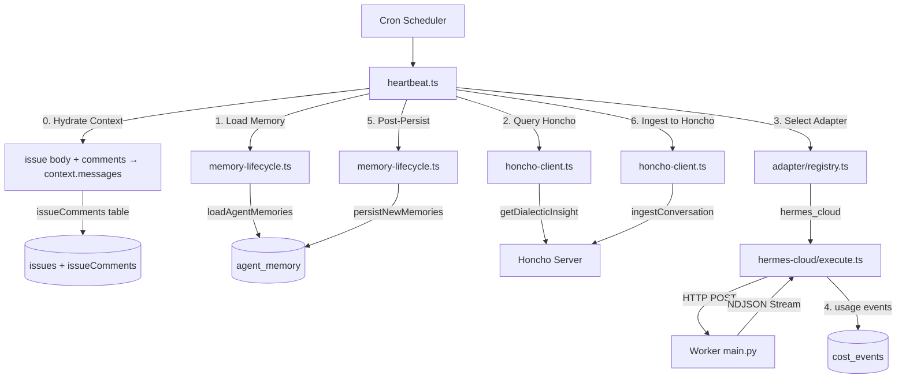
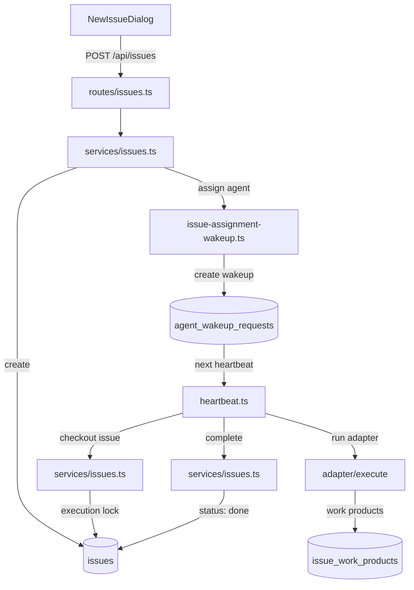
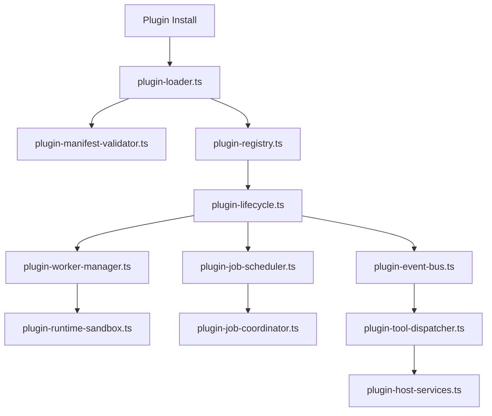
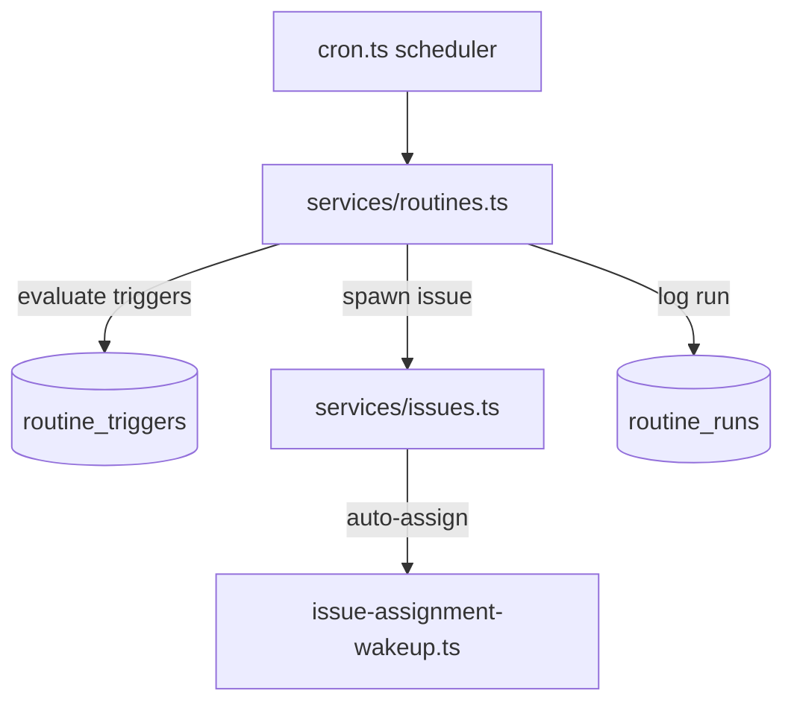
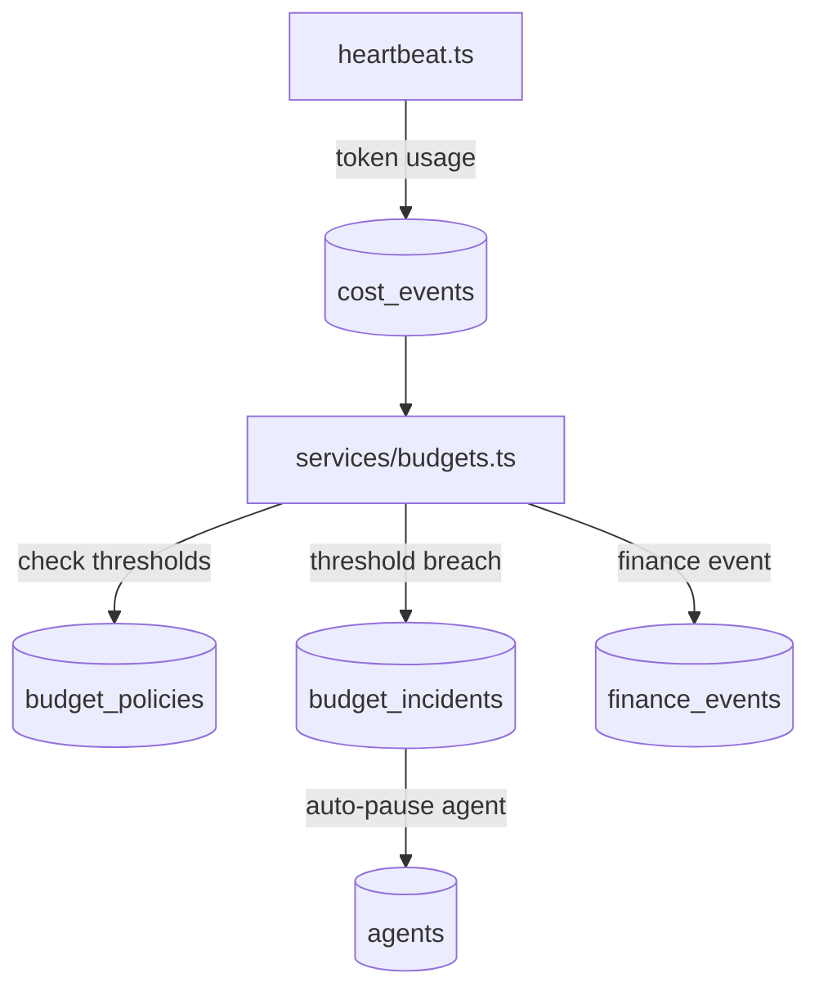

# 🔀 Module Interaction Map — Deep Research v4

> Generiert: 2026-04-01 | Letztes Update: 2026-04-02

## Pipeline 1: Agent Heartbeat Execution

### Datenfluss
| Schritt | Modul | Input | Output | Ziel |
|---------|-------|-------|--------|------|
| 1 | `memory-lifecycle.ts` | company_id, agent_id | MemoryEntry[] | heartbeat context |
| 2 | `honcho-client.ts` | app_id, user_id, task | insight string | heartbeat context |
| 3 | `adapter/registry.ts` | adapter_key | ExecuteAdapter | heartbeat dispatch |
| 4 | `hermes-cloud/execute.ts` | ExecuteRequest | NDJSON stream | heartbeat events |
| 5 | `memory-lifecycle.ts` | save_memory events | DB inserts | agent_memory |
| 6 | `honcho-client.ts` | conversation messages | Honcho session | Honcho storage |

## Pipeline 2: Issue Lifecycle

## Pipeline 3: Plugin System

## Pipeline 4: Routines Automation

## Pipeline 5: Budget & Cost Control

## Cross-Domain Wiring
| Source Pipeline | Target Pipeline | Mechanismus | Beschreibung |
|----------------|-----------------|-------------|--------------|
| Heartbeat | Issue Lifecycle | Issue checkout/complete | Agent bearbeitet Issues während Heartbeat |
| Heartbeat | Budget Control | cost_events write | Token-Nutzung triggert Budget-Checks |
| Routines | Issue Lifecycle | Issue auto-create | Routine-Trigger erzeugen neue Issues |
| Plugin System | Heartbeat | Tool contributions | Plugins erweitern Agent-Toolsets |
| Issue Lifecycle | Approval System | issue_approvals | Governance-Gates für Aktionen |
