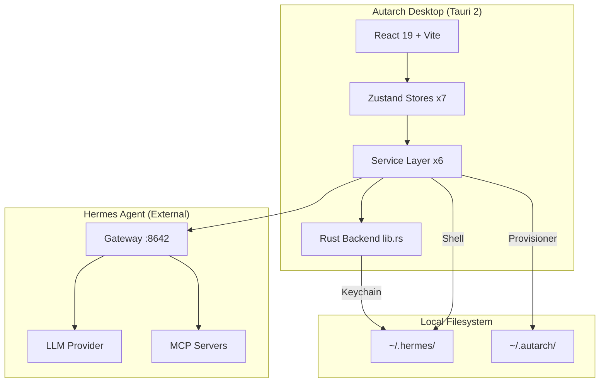
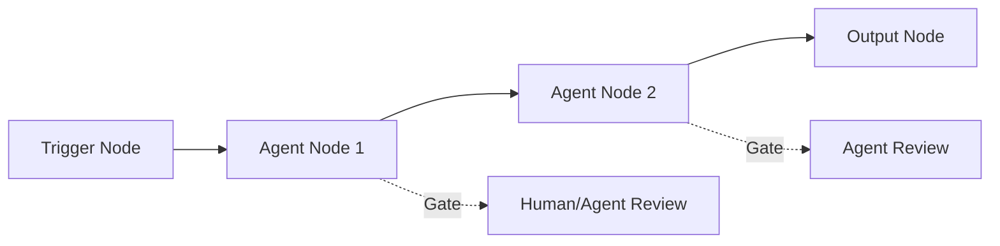
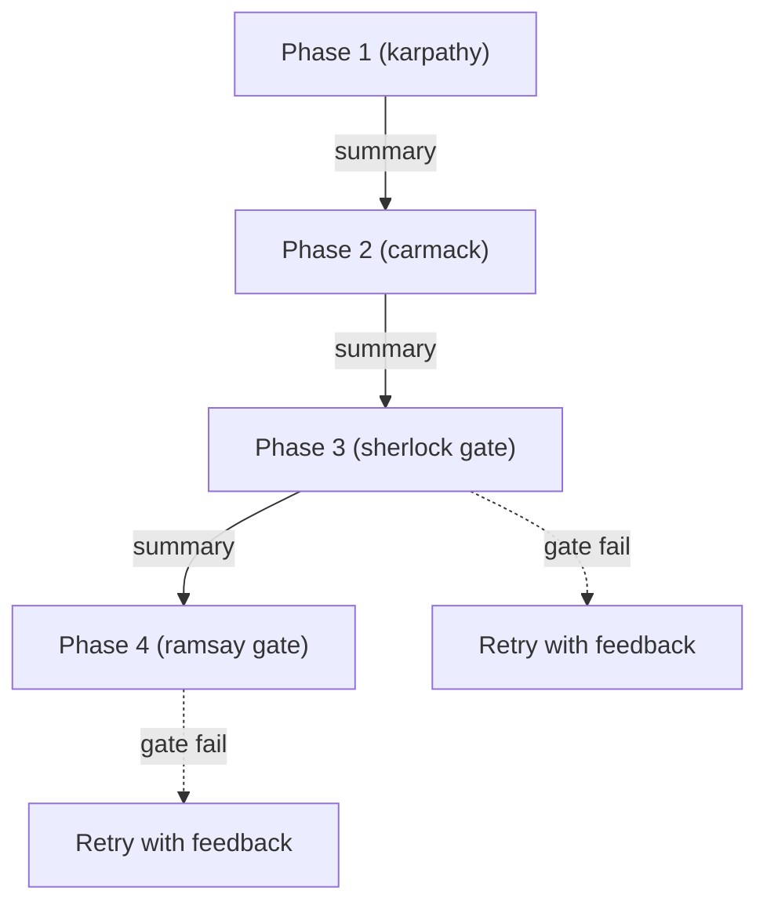

# 🔬 Autarch OS — Ground of Truth

> Deep Research abgeschlossen. Exhaustive Codebase-Analyse, 1907 Commits, 50+ Source-Dateien gelesen.

---

## 1. Systemübersicht

**Autarch** ist eine self-hosted Desktop-IDE auf Basis von **Tauri 2 + React 19 + Vite**, konzipiert als **Agentic Operating System**. Die App orchestriert den externen **Hermes Agent** (NousResearch) via HTTP/SSE und erweitert ihn um ein **Persona-System**, **Visual Workflow Engine** und **OTA Kit Provisioning**.



---

## 2. Tech Stack — Exact Versions

| Layer | Technology | Version |
|-------|-----------|---------|
| **Runtime** | Tauri | 2.5.0 |
| **Frontend** | React | 19.0.0 |
| **Bundler** | Vite | 6.3.2 |
| **State** | Zustand | 5.0.4 |
| **Styling** | Tailwind CSS | 4.1.3 |
| **Animation** | Framer Motion | 12.6.3 |
| **Editor** | Monaco Editor | 0.52.2 |
| **Terminal** | tauri-pty | 0.4.5 |
| **Workflow** | @xyflow/react | 12.4.4 |
| **Panels** | react-resizable-panels | 2.1.9 |
| **Icons** | Lucide React | 0.475.0 |
| **Rust** | keyring, tauri-plugin-pty, tauri-plugin-shell | latest |

---

## 3. Architektur — Layer Map

### 3.1 Frontend Layer (`src/`)

```
src/
├── App.tsx                    # Root: Lazy load + mode switch (standard/agentic)
├── presets/                   # Pluggable module system
│   ├── index.ts               # Single point: activePreset = vanillaPreset
│   ├── types.ts               # PresetConfig, ModuleDefinition, ContextItem
│   ├── vanilla.ts             # Default preset (+ workflowModule)
│   └── modules/               # Plugin modules (workflow, future: marketing, etc.)
├── components/
│   ├── layout/
│   │   ├── TopNav.tsx          # Core tabs + Hermes status indicator + ModelSwitcher
│   │   ├── ContextPanel.tsx    # Left sidebar: dynamic context nav per tab
│   │   └── AgenticLayout.tsx   # Agentic mode: 3-panel resizable (sessions/chat/explorer)
│   ├── views/                  # 17 view components (see Section 4)
│   └── workflow/               # 5 React Flow node components
├── stores/                     # 7 Zustand stores (see Section 5)
├── services/                   # 6 service modules (see Section 6)
├── types/                      # Type definitions
│   ├── workflow.types.ts       # WorkflowDocument, GateConfig, NodeData unions
│   └── executionPlan.types.ts  # ExecutionPlan, PhaseDefinition, GateResult, PersonaId
├── hooks/
│   └── workflow/               # useWorkflowExecution
└── styles/
    └── globals.css             # Design system tokens (Tailwind v4 @theme)
```

### 3.2 Rust Backend (`src-tauri/src/`)

Minimal — nur **3 Tauri-Commands**:

| Command | Purpose |
|---------|---------|
| `greet` | Dev test (placeholder) |
| `set_keychain_secret` | Secure API key storage via macOS Keychain |
| `get_keychain_secret` | Retrieve API key from macOS Keychain |

**6 Tauri Plugins** registered:
1. `tauri_plugin_opener` — URL/file opening
2. `tauri_plugin_shell` — Shell command execution 
3. `tauri_plugin_pty` — Pseudo-terminal for embedded Terminal
4. `tauri_plugin_os` — OS detection
5. `tauri_plugin_dialog` — Native file dialogs
6. `tauri_plugin_fs` — Filesystem access

**Security Capabilities** (`capabilities/default.json`):
```json
["core:default", "opener:default", "shell:allow-execute",
 "shell:allow-spawn", "shell:allow-stdin-write", "shell:allow-kill",
 "shell:allow-open", "pty:default", "fs:default", "dialog:default"]
```

> [!WARNING]
> `shell:allow-execute` + `shell:allow-spawn` sind sehr permissiv. Kein scope-basiertes Command-Filtering aktiv.

### 3.3 Hermes Kit (`hermes-kit/`)

Bundled resource directory, deployed nach `~/.hermes/` und `~/.autarch/skills/`:

```
hermes-kit/
├── config.yaml            # 3-Tier LLM Cascading + 16 Personas
├── SOUL.md                # Lead Architect Identity
├── kit-manifest.json      # Version: 1.0.0
├── personas/              # (Empty — inline in config.yaml)
└── skills/                # 15 skill directories (agentic-plan, fortress-audit, etc.)
```

---

## 4. View Components — 17 Files

| Component | Size | Description |
|-----------|------|-------------|
| `AgentChat.tsx` | 20KB | Full chat UI: install CTA → offline → online states, streaming, tool calls |
| `ApiKeysSettings.tsx` | 40KB | API key management per provider, Keychain integration |
| `SettingsModules.tsx` | 26KB | Module installer UI (Hermes, Zed, Monaco) |
| `MainStage.tsx` | 11KB | Dynamic view resolver per activeTab + contextView |
| `PhaseTracker.tsx` | 9KB | Execution plan visualization |
| `AgentInlineEditOverlay.tsx` | 7KB | Agent-assisted inline code editing |
| `MonacoEditor.tsx` | 7KB | Monaco editor wrapper with Tauri FS integration |
| `WorkflowCanvas.tsx` (workflow/) | 6KB | React Flow canvas with execution status |
| `ConversationList.tsx` | 5KB | Chat history sidebar |
| `ToolCallBlock.tsx` | 5KB | Individual tool call visualization |
| `FleetPanel.tsx` | 4KB | Agent fleet dashboard |
| `McpFeedPanel.tsx` | 4KB | MCP server status feed |
| `GateConfigPanel.tsx` (workflow/) | 4KB | Gate mode configuration |
| `Terminal.tsx` | 4KB | xterm.js PTY terminal |
| `SkillsBrowser.tsx` | 3KB | Skill directory browser |
| `MemoryPanel.tsx` | 3KB | Memory bank viewer |
| `SessionListPanel.tsx` | 3KB | Session list for agentic mode |
| `FileExplorer.tsx` | 3KB | Workspace file tree |
| `ModelSwitcher.tsx` | 3KB | Active model dropdown selector |

---

## 5. State Management — 7 Zustand Stores

| Store | Persisted | Key State |
|-------|-----------|-----------|
| **hermesStore** | ✅ (conversations, model) | Connection status, gateway process, messages, streaming buffer, tool calls, conversations |
| **layoutStore** | ✅ (mode, panel sizes) | activeTab, contextView, mode (standard/agentic) |
| **editorStore** | ❌ | Workspace root, file tree, open files, file contents |
| **terminalStore** | ❌ | PTY state, Hermes install phase, reactive output parser |
| **workflowStore** | ❌ | Active workflow (WorkflowDocument), React Flow state |
| **executionPlanStore** | ✅ (history, plan, state) | Active plan, phase tracking, streaming output |
| **moduleStore** | ❌ | Module registry (hermes/zed/monaco), install progress |

---

## 6. Service Layer — 6 Modules

### 6.1 `hermesClient.ts` (267 lines)
- HTTP client for Hermes Gateway (`localhost:8642`)
- `checkHermesHealth()` — GET `/health`
- `streamChat()` — SSE-based streaming via POST `/v1/chat/completions`
- `sendChat()` — Non-streaming chat
- `startRun()` / `subscribeToRun()` — Agentic run management

### 6.2 `hermesBridge.ts` (937 lines) — **Largest file**
- `syncToHermes()` — Non-destructive YAML patching of `~/.hermes/config.yaml`
- `executeWithPersona()` — Injects persona system prompts before Hermes calls
- `executeGate()` — Quality gate evaluation via LLM jury
- `executeWorkflow()` — Full workflow execution with topological sort + gate checking
- 16 persona definitions hardcoded in `PERSONA_MAP`

### 6.3 `hermesGateway.ts` (187 lines)
- Start/Stop Hermes Gateway process via shell
- Health endpoint polling (`GET /health`, 3s timeout)
- PID-based lifecycle (pgrep + SIGTERM/SIGKILL)

### 6.4 `hermesProvisioner.ts` (619 lines)
- Kit deployment: bundle → `~/.hermes/` + `~/.autarch/skills/`
- Semver version tracking via `~/.autarch/kit.json`
- OTA update flow: remote manifest → curl download → staging → apply
- Non-destructive: backs up user-modified config.yaml

### 6.5 `planExecutor.ts` (416 lines)
- Multi-phase execution engine with dependency resolution
- Per-phase persona injection + streaming output
- Gate evaluation with retry logic (max 2 retries)
- Context summarization between phases (summary strategy)

### 6.6 `moduleInstaller.ts` (571 lines)
- Auto-detection of Hermes + Zed installations
- `installHermes()`: git clone → setup-hermes.sh → kit provisioning
- `installZed()`: Homebrew or official installer script

### 6.7 `eventBus.ts` (166 lines)
- Typed discriminated union event system (12 event types)
- Categories: tool, message, reasoning, run, workflow, node

---

## 7. Execution Pipelines

### 7.1 Workflow Engine (Visual DAG)



**Gate Modes**: `auto` | `human` | `agent-review`

**Execution Flow**:
1. Topological sort of nodes
2. Per-node: gather predecessor outputs → execute → evaluate gate
3. `human` gates pause execution (resumable)
4. `agent-review` gates use LLM jury (configurable reviewer persona)
5. All events broadcast via `hermesEventBus`

### 7.2 Execution Plan Engine (Linear Phases)



**Features**:
- Per-phase persona assignment
- Cross-phase context summarization (prevents context overflow)
- Gate retry with feedback injection (failed criteria → re-attempt)
- Event-driven progress tracking (plan → phase → gate lifecycle)

---

## 8. Persona System — 16 Specialists

| Category | Personas |
|----------|----------|
| 🔧 Engineering | carmack, karpathy, uncle-bob, hamilton |
| 🔍 Quality | sherlock, ramsay, mr-robot |
| 🎨 Product | jobs, elon, rauno, jonah |
| 📈 Marketing | draper, hormozi, gary-vee |
| 🧠 Strategy | taleb, kahneman |
| 🏗️ Baseline | `default` (SOUL.md) |

**Implementation**: Dual definition — identical prompts in both `hermesBridge.ts` (PERSONA_MAP) and `hermes-kit/config.yaml` (agent.personalities). **DRY Violation** — Abweichungen möglich.

---

## 9. Preset System (Plugin Architecture)

```mermaid
graph LR
  PresetConfig -->|modules[]| ModuleDefinition
  ModuleDefinition -->|tab| TabDefinition
  ModuleDefinition -->|contextItems| ContextItem
  ModuleDefinition -->|resolveView| ReactNode
```

**Current Presets**:
- `vanilla` — Default (+ workflowModule)
- `ares` — (Referenced but not implemented)

**Extension Pattern**: New modules nur über `PresetConfig.modules[]` registrieren. Uncle Bob dependency rule: `presets → modules → core`, never backwards.

---

## 10. Design System Tokens

Definiert in `globals.css` via Tailwind v4 `@theme`:

| Token Category | Values |
|---------------|--------|
| **Surface** | 7 tiers: void(#000) → base(#09090b) → bright(#2e2e33) |
| **Accent** | Amber/Gold: #f59e0b → #d97706 → #92400e |
| **Text** | 3 tiers: primary(#fafafa) / secondary(#a1a1aa) / tertiary(#71717a) |
| **Border** | Ghost (rgba 40%) / Active (amber 30%) |
| **Semantic** | error(red) / success(emerald) / warning(amber) / info(indigo) |
| **Typography** | Display: Space Grotesk / Body: Inter / Mono: JetBrains Mono |

**Utility Classes**: `.glass-panel`, `.ghost-border`, `.accent-glow`, `.label-tag`

---

## 11. Hermes Kit Skills (15 Agents)

Bundled unter `hermes-kit/skills/`:

| Skill | Domain |
|-------|--------|
| agentic-plan | Autonomous multi-phase planning |
| brainstorm | Spec-before-code dialog |
| cinematic-ui | Framer Motion + design system |
| deep-research | Exhaustive knowledge excavation |
| deep-work | Extended focused execution |
| draper-copy | UI copy review |
| fortress-audit | Code quality audit |
| hotfix | Quick bugfix cycle |
| jobs-keynote | Feature launch story |
| recon | Codebase indexing |
| security-sweep | RLS, PII, DSGVO check |
| ship-it | Build → deploy → commit |
| simplify | Radical simplification |
| tdd | Test-driven development |
| update-memory | Session-end memory update |

---

## 12. Datenflüsse

### 12.1 Chat Flow
```
User → AgentChat.tsx → hermesStore.submitRun()
  → hermesClient.startRun() → POST /v1/chat/completions
  → SSE stream → hermesEventBus → hermesStore (messages/toolCalls)
  → React re-render
```

### 12.2 Hermes Install Flow
```
AgentChat "Install" CTA → terminalStore.installHermes()
  → window.confirm (W-07 security gate)
  → PTY inject: curl | bash (NousResearch installer)
  → handlePtyOutput() reactive parser
    → 'installing' → 'setup-wizard' → 'provisioning' → 'done'
  → hermesProvisioner.applyHermesKit()
    → config.yaml → ~/.hermes/
    → SOUL.md → ~/.hermes/
    → skills/ → ~/.autarch/skills/
    → kit.json → ~/.autarch/
```

### 12.3 API Key Flow
```
ApiKeysSettings.tsx → Tauri invoke("set_keychain_secret")
  → Rust keyring::Entry → macOS Keychain
  → hermesBridge.syncToHermes() → YAML patch → ~/.hermes/.env
```

---

## 13. Security Assessment

> [!CAUTION]
> **Bekannte Risiken die vor Production adressiert werden müssen:**

| # | Finding | Severity | Location |
|---|---------|----------|----------|
| S-1 | Shell capabilities zu permissiv (`shell:allow-execute/spawn` ohne scope) | 🔴 HIGH | `capabilities/default.json` |
| S-2 | Persona prompts doppelt definiert (hermesBridge + config.yaml) — Drift-Risiko | 🟡 MEDIUM | hermesBridge.ts:L31-48, config.yaml:L67-217 |
| S-3 | `curl | bash` Installer ohne Checksum-Verifikation | 🟡 MEDIUM | terminalStore.ts:L37-38 |
| S-4 | Base64-Encoding für kit.json Schreiben — fragil bei Sonderzeichen | 🟢 LOW | hermesProvisioner.ts:L309-313 |
| S-5 | OTA Kit Update ohne SHA-256 Integrity Check (nur Platzhalter im Manifest) | 🟡 MEDIUM | hermesProvisioner.ts:L37 |
| S-6 | `any` TypeScript cast in Gate evaluation response parsing | 🟢 LOW | planExecutor.ts:L152 |
| S-7 | EventBus verwendet `Function` Type (eslint-disable) | 🟢 LOW | eventBus.ts:L133-134 |

---

## 14. File Metrics

| Metric | Count |
|--------|-------|
| Total TypeScript/TSX files | ~50 |
| Total Lines of Code (services) | ~2,960 |
| Total Lines of Code (stores) | ~1,313 |
| Total Lines of Code (views) | ~3,500+ |
| Zustand Stores | 7 |
| Tauri Commands (Rust) | 3 |
| Tauri Plugins | 6 |
| Persona Definitions | 16 (+default) |
| Hermes Kit Skills | 15 |
| Git Commits | 1,907 |
| React Flow Node Types | 3 (trigger, agent, output) |
| Event Bus Event Types | 12 |

---

## 15. Invarianten & Architektur-Regeln

1. **"Autarch orchestriert, bündelt nicht."** — Hermes ist extern, Autarch nur UI/Config Layer.
2. **Vanilla Core First** — Keine ARES-spezifischen Dependencies im Core.
3. **Preset Dependency Rule**: `presets → modules → core`, never backwards.
4. **Non-destructive Config** — config.yaml wird per YAML-Patch aktualisiert, nicht überschrieben.
5. **Kit Versioning** — Semver in `~/.autarch/kit.json`, idempotente Provisioning.
6. **Gate System** — Jeder Workflow-Node kann `auto`, `human`, oder `agent-review` Gate haben.
7. **Dual Layout** — `standard` (IDE mit Sidebar) vs. `agentic` (3-Panel Resizable).
8. **Keychain-only Secrets** — API Keys gehen durch Rust → macOS Keychain, nie in localStorage.
